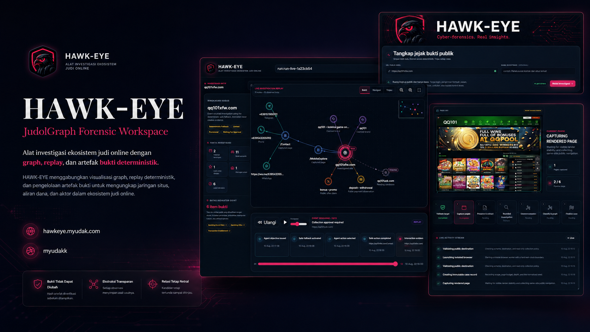
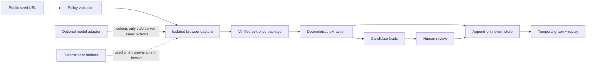
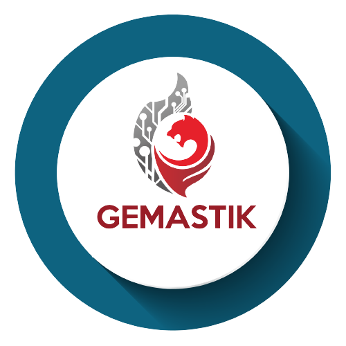

<div align="center">
  <a href="https://hawkeye.myudak.com">
    
  </a>

  <br />
  <br />

  <h1>HAWK-EYE / JudolGraph</h1>

  <p><strong>Evidence-first OSINT for investigating online gambling ecosystems.</strong></p>

  <p>
    HAWK-EYE turns a public seed URL into a reproducible investigation package: captured pages,<br />
    traceable observations, a temporal relationship graph, reviewable leads, and an auditable replay.
  </p>

  <p>
    <a href="https://hawkeye.myudak.com"></a>
    <a href="https://www.python.org/"></a>
    <a href="https://react.dev/"></a>
    <a href="https://fastapi.tiangolo.com/"></a>
    <a href="https://www.docker.com/"></a>
    <a href="https://github.com/myudak/hawkeye-judolgraph/actions/workflows/ci.yml"></a>
    <a href="https://github.com/myudak/hawkeye-judolgraph/releases"></a>
  </p>

  <p>
    <a href="https://hawkeye.myudak.com">Live demo</a> ·
    <a href="#how-it-works">How it works</a> ·
    <a href="#quick-start">Quick start</a> ·
    <a href="#architecture">Architecture</a> ·
    <a href="#documentation">Documentation</a>
  </p>
</div>

> [!IMPORTANT]
> HAWK-EYE is a **read-only public-web investigation instrument**. It does not bypass access
> controls, solve CAPTCHAs, sign in, submit forms, download files, or automatically accuse an
> operator. A discovered domain is a candidate lead until a human reviews the supporting evidence.

## Why this project exists

Online investigations often end as disconnected screenshots, browser history, and conclusions that
cannot be reproduced. HAWK-EYE approaches the problem as an evidence system rather than a generic
scraper or opaque AI wrapper.

It preserves what a public website showed, records how each observation was extracted, reconstructs
the investigation as an append-only event stream, and keeps uncertain relationships visibly
pending. The result is designed to answer three practical questions:

1. **What was observed?** — captured pages, screenshots, rendered HTML, visible text, response
   metadata, and normalized public indicators.
2. **Why is it on the graph?** — every semantic node resolves back to its source page and artifact.
3. **What changed over time?** — replay and temporal comparison rebuild the investigation from
   persisted events instead of decorative animation.

## Product highlights

| Capability                    | What it delivers                                                                                                                                     |
| ----------------------------- | ---------------------------------------------------------------------------------------------------------------------------------------------------- |
| **Evidence-first capture**    | Full-page screenshots, rendered HTML, visible text, response metadata, capture checkpoints, and optional OCR.                                        |
| **Bounded investigation**     | Safe same-site navigation and controlled public interactions inside an isolated Playwright worker with a hard deadline.                              |
| **Explainable extraction**    | Deterministic contacts, payment indicators, public claims, links, brands, and gambling-language indicator counts.                                    |
| **Temporal evidence graph**   | Canvas-based graph projected from persisted events, with filters, inspector provenance, minimap, and deterministic replay.                           |
| **Human-reviewed leads**      | Candidate relationships remain pending until an append-only review decision is recorded. Candidate domains are never crawled automatically.          |
| **Optional model assistance** | An OpenAI-compatible model may select from server-issued safe actions; invalid output, timeout, or missing credentials falls back deterministically. |
| **Reproducible evaluation**   | Ten controlled interaction fixtures, benchmarks, sanitized demos, strict schemas, and automated safety regression tests.                             |
| **Portable delivery**         | Windows installer/portable ZIP with bundled Chromium, locked `pnpm` and `uv` dependencies, a Python wheel, and hardened Docker runtime.              |

## How it works



The model is deliberately **not** given unrestricted browser, shell, or filesystem access. It sees a
normalized page context and may choose only from bounded references issued by the server. The policy
layer remains authoritative regardless of provider.

## Investigation workspace

The interface is organized around a single evidence trail:

- **Case summary** shows scope, capture adequacy, indicator counts, candidates, and review state.
- **Graph workspace** distinguishes seed domains, captured pages, contacts, claims, payments,
  brands, and pending destinations with stable visual semantics.
- **Evidence inspector** connects a selected observation to its page, artifact, extraction method,
  timestamp, and limitation note.
- **Replay timeline** reconstructs graph state from persisted events and separates live, completed,
  and historical states.
- **Progressive scan** displays real capture frames and truthful phase updates while the isolated
  worker is running.
- **Case summary and exports** provide human-readable Markdown, JSON, and a portable evidence
  package for review.

## Architecture

```text
apps/                       API, investigator app, and static marketing site
packages/                   Shared brand, design, graph, and UI packages
competition/gemastik-2026/  Proposal, technical sources, submission material, and assets
distribution/windows/       PyInstaller and installer definitions
evaluation/                 Controlled fixtures and benchmark inputs
infra/docker/               Chromium seccomp and container guidance
tools/                      Development, verification, release, and GEMASTIK tooling
docs/                       Durable context plus architecture, security, operations, and guides
tests/                      Cross-system regression and acceptance tests
data/                       Local cases and SQLite workspace (ignored)
```

### Engineering decisions

- **One source of truth:** case artifacts and append-only SQLite events drive graph, inspector,
  timeline, review state, and exports.
- **Deterministic by default:** core capture and extraction work without an LLM credential.
- **Provider-neutral AI:** the optional adapter supports strict OpenAI Responses or Chat Completions
  compatible endpoints without coupling the evidence model to a vendor.
- **Killable browser boundary:** browser work runs outside the API process and is terminated as a
  process tree when its wall-clock deadline expires.
- **Local-first security:** the default server binds to loopback; Docker runs non-root with a
  read-only root filesystem, dropped capabilities, a pinned Chromium seccomp profile, and persistent
  data mounted separately.
- **Truthful uncertainty:** evidence similarity is not ownership probability, and a candidate is not
  a confirmed operator relationship.

## Technology stack

| Layer               | Technology                                                   |
| ------------------- | ------------------------------------------------------------ |
| Web application     | React 19, TypeScript, Vite 8, Tailwind CSS 4, TanStack Query |
| API and domain core | Python 3.12, FastAPI, Pydantic                               |
| Browser collection  | Playwright 1.50, Chromium                                    |
| Evidence processing | Beautiful Soup, Pillow, optional Tesseract OCR               |
| Persistence         | Append-only SQLite workspace plus filesystem case packages   |
| Quality             | Pytest, Vitest, Ruff, mypy strict, ESLint, Prettier          |
| Tooling             | pnpm workspace, uv lockfile, multi-stage Docker build        |

## Quick start

### Option A — Windows app

Download either asset from [GitHub Releases](https://github.com/myudak/hawkeye-judolgraph/releases):

- `HAWK-EYE-Setup-<version>-windows-x64.exe` — recommended per-user installer with Start Menu and
  optional desktop shortcuts;
- `HAWK-EYE-<version>-windows-x64-portable.zip` — extract the complete folder, then double-click
  `HAWK-EYE.exe`.

No Python, Node.js, pnpm, uv, or browser download is required. HAWK-EYE opens in the default browser
and remains available from its Windows notification-area icon. Investigation data is stored in
`%LOCALAPPDATA%\HAWK-EYE`, outside the application directory, so upgrades do not replace it.

### Option B — Docker

The simplest path requires Docker Desktop with Compose v2.

```bash
git clone https://github.com/myudak/hawkeye-judolgraph.git
cd hawkeye-judolgraph
docker compose up -d --build
```

Open [http://127.0.0.1:8760](http://127.0.0.1:8760). Local investigation data persists under
`./data` across container restarts.

```bash
docker compose down
```

### Option C — Manual development

Requirements: Python 3.12, [uv](https://docs.astral.sh/uv/), Node.js 22.12+, and Corepack.

```bash
git clone https://github.com/myudak/hawkeye-judolgraph.git
cd hawkeye-judolgraph

corepack enable
pnpm install --frozen-lockfile
pnpm setup
pnpm dev
```

This starts FastAPI on `127.0.0.1:8760` and Vite on `127.0.0.1:5173` with API proxying and hot
module replacement.

## Optional model configuration

HAWK-EYE remains functional without a model. To enable provider-assisted action selection, copy
`.env.example` to the ignored `.env` file and configure an OpenAI-compatible endpoint:

```dotenv
HAWKEYE_LLM_BASE_URL=https://openrouter.ai/api/v1
HAWKEYE_LLM_API_KEY=replace-with-your-key
HAWKEYE_LLM_MODEL=openai/gpt-5.6-luna
HAWKEYE_LLM_API_STYLE=chat_completions
HAWKEYE_LLM_TIMEOUT_SECONDS=15
```

Run the explicit, opt-in handshake before starting the application:

```bash
uv run --env-file .env hawkeye llm-probe
pnpm start
```

The UI reports one of five honest capability states: `fallback_only`,
`model_configured_unverified`, `model_ready`, `model_unavailable`, or `configuration_invalid`.
Opening the landing page never performs a paid model probe.

<details>
<summary><strong>OpenRouter with Docker</strong></summary>

Add the key and desired model to `.env`, then use the checked-in override:

```dotenv
OPENROUTER_APIKEY=replace-with-your-key
OPENROUTER_MODEL=openai/gpt-5.6-luna
```

```bash
docker compose -f compose.yaml -f compose.openrouter.yaml up -d --build
```

The credential is supplied only at runtime and is not baked into the image.

</details>

## Security and evidence boundary

HAWK-EYE intentionally trades unrestricted autonomy for reproducibility and operator control.

### It does

- collect publicly accessible, read-only content within a bounded scope;
- validate destinations before browser navigation;
- keep artifact provenance and integrity metadata;
- reject model references that were not issued by the server;
- require human review before treating a candidate relationship as accepted;
- preserve review decisions in append-only history.

### It does not

- bypass authentication, CAPTCHA, Cloudflare, geographic restrictions, or rate limits;
- log in, submit forms, send messages, initiate payments, or download arbitrary files;
- automatically crawl candidate domains;
- claim legal status, criminality, ownership, or operator identity;
- treat a similarity score as a probability of common ownership.

The optional public demo configuration adds an exact browser-origin boundary and optional HTTP Basic
Auth, but it is not a substitute for a multi-user authorization architecture. The supported default
remains a local, single-investigator deployment.

## Developer workflow

| Command                | Purpose                                                              |
| ---------------------- | -------------------------------------------------------------------- |
| `pnpm setup`           | Sync locked Python dependencies and install Chromium.                |
| `pnpm dev`             | Run API and web development servers together with optional `.env`.   |
| `pnpm build`           | Build React into the backend static bundle.                          |
| `pnpm start`           | Build and run the production-like local server with optional `.env`. |
| `pnpm check`           | Run formatting, lint, types, tests, build, and diff checks.          |
| `pnpm package`         | Build the UI and produce an installable Python wheel.                |
| `pnpm package:windows` | Build the Windows onedir and portable ZIP on a Windows host.         |
| `pnpm verify:manual`   | Exercise a clean manual installation and health check.               |
| `pnpm verify:docker`   | Run the isolated Docker acceptance suite.                            |

Useful CLI entry points:

```bash
uv run hawkeye collect https://example.com --output data/cases
uv run hawkeye app --data data --port 8760
uv run hawkeye benchmark --output data/benchmark
uv run hawkeye demo --output data/demo
uv run hawkeye llm-probe
```

Live URLs are opt-in qualitative inputs, not automated test truth. The deterministic test suite uses
controlled local fixtures.

## Documentation

- [Product goal](docs/GOAL.md)
- [Roadmap](docs/ROADMAP.md)
- [Architecture decisions](docs/DECISIONS.md)
- [Current verification status](docs/STATUS.md)
- [Evaluation protocol](docs/EVALUATION.md)
- [Deployment and backup guide](docs/operations/DEPLOYMENT.md)
- [Windows application and release guide](docs/operations/WINDOWS_DISTRIBUTION.md)
- [Docker runtime notes](infra/docker/README.md)
- [GEMASTIK 2026 package](competition/gemastik-2026/README.md)

## Project story

HAWK-EYE was built as a GEMASTIK-ready engineering project around a deceptively difficult question:
how can a web investigation be visually useful without becoming opaque, over-automated, or
semantically careless?

The implementation spans browser isolation, evidence packaging, deterministic extraction, policy-
constrained model assistance, append-only persistence, temporal graph projection, human review,
container hardening, and a production-grade React interface. The product is intentionally honest
about incomplete capture and uncertain relationships—the parts most dashboards hide.

## Author

<div align="center">

  <p>
    
    &nbsp;&nbsp;&nbsp;&nbsp;
    
  </p>

  <h3>HAWK-EYE</h3>

  <strong>Dirancang oleh Tim</strong>
  <br />
  <strong>Ajarin Kami Sepuh</strong>

  <br />
  <br />

  <table>
    <tr>
      <td align="left">Muchammad Yuda Tri Ananda</td>
    </tr>
    <tr>
      <td align="left">Olivia Oktaviani</td>
    </tr>
    <tr>
      <td align="left">Syifa Aeni Mudrikah</td>
    </tr>
  </table>

  <sub>Universitas Diponegoro · GEMASTIK XIX</sub>

  <br />
  <br />

  <a href="https://hawkeye.myudak.com">Live Demo</a>
  ·
  <a href="https://github.com/myudak/hawkeye-judolgraph">GitHub</a>

</div>