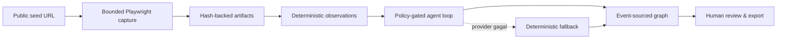

# HAWK-EYE / JudolGraph

HAWK-EYE adalah aplikasi OSINT lokal untuk mengumpulkan, menyimpan, dan menghubungkan bukti publik
dari sebuah situs. Aplikasi ini memakai browser terisolasi, menyimpan artefak dengan hash, mengekstrak
observasi deterministik, lalu memproyeksikannya sebagai graph dan timeline yang dapat diaudit.

> **Batas penting:** kandidat bukan bukti kepemilikan, similarity bukan probabilitas, dan indikator
> judi bukan kesimpulan legal. HAWK-EYE tidak login, mengirim form/pesan, membeli, menyelesaikan
> CAPTCHA, melewati pembatasan akses, atau otomatis merayapi kandidat baru.

## Mulai cepat

Pilih salah satu jalur berikut.

### A. Docker — paling mudah

Butuh Docker Desktop atau Docker Engine dengan Compose v2.

```powershell
Copy-Item .env.example .env
docker compose up --build -d
```

Buka [http://127.0.0.1:8760](http://127.0.0.1:8760).

```powershell
# Lihat log
docker compose logs -f hawkeye

# Stop tanpa menghapus data
docker compose down
```

Cases, SQLite review history, dan artefak berada di `./data` dan tetap ada setelah container
direstart. Compose hanya mem-publish port ke `127.0.0.1`, bukan ke LAN atau internet.

### B. Manual — pnpm + uv

Butuh Python 3.12, [uv](https://docs.astral.sh/uv/), Node.js 22+, dan pnpm 11.3.0.

```powershell
corepack enable
corepack prepare pnpm@11.3.0 --activate
pnpm install --frozen-lockfile
pnpm setup
pnpm start
```

`pnpm setup` menjalankan `uv sync --locked --extra dev` dan memasang Chromium yang cocok dengan
versi Playwright. `pnpm start` membangun React lalu menyajikannya dari FastAPI di
`http://127.0.0.1:8760`.

Untuk development dengan Vite HMR:

```powershell
pnpm dev
```

## Cara kerja singkat



Model tidak mengontrol browser secara langsung. Model hanya menerima konteks yang sudah
dinormalisasi dan reference aman yang diterbitkan server. Semua tool request tetap divalidasi oleh
policy HAWK-EYE.

## Struktur repository

```text
apps/
├── api/
│   └── src/hawkeye/       Python, FastAPI, collector, agent, storage, CLI
└── web/                    React, Vite, Tailwind, shadcn/ui
tests/                      Test IDs dan fixture paths yang stabil
evaluation/                 Controlled fixtures, manifests, benchmark
docs/                       Goal, decisions, status, deployment, evaluation
gemastik-2026/              Sumber Markdown paket GEMASTIK
infra/docker/               Catatan khusus container
scripts/                    Build dan acceptance verification
data/                       Data lokal; di-ignore Git
```

File manifest tetap berada di root agar satu command dapat mengorkestrasi seluruh monorepo:

- `package.json`, `pnpm-workspace.yaml`, `pnpm-lock.yaml` — JavaScript dan root commands.
- `pyproject.toml`, `uv.lock`, `.python-version` — Python dan packaging.
- `Dockerfile`, `compose.yaml` — deployment lokal satu service.

Folder `.venv`, `node_modules`, `build`, `dist`, `data`, `tmp`, caches, dan `*.egg-info` adalah hasil
lokal/generated dan tidak masuk Git.

## Konfigurasi model opsional

Tanpa model, seluruh produk tetap bekerja memakai deterministic fallback. Label **Fallback aman**
di landing page berarti base URL/model belum dikonfigurasi, bukan engine mati.

Salin `.env.example` menjadi `.env`, kemudian isi:

```dotenv
HAWKEYE_LLM_BASE_URL=https://provider.example/v1
HAWKEYE_LLM_API_KEY=isi-hanya-di-mesin-lokal
HAWKEYE_LLM_MODEL=model-id
HAWKEYE_LLM_API_STYLE=auto
HAWKEYE_LLM_TIMEOUT_SECONDS=15
```

Untuk mode manual yang membaca `.env`:

```powershell
pnpm start:env
```

Compose membaca `.env` secara otomatis. Landing page tidak melakukan probe berbayar. Verifikasi
provider secara eksplisit dengan:

```powershell
uv run --env-file .env hawkeye llm-probe `
  --output verification-output/llm-capability.json
```

### Memakai Codex LB lokal

Codex LB dapat dipakai sebagai provider OpenAI-compatible biasa:

```dotenv
HAWKEYE_LLM_BASE_URL=http://127.0.0.1:2455/v1
HAWKEYE_LLM_MODEL=gpt-5.6-terra
HAWKEYE_LLM_API_STYLE=auto
```

Jika Codex LB sudah menyimpan credential upstream, HAWK-EYE tidak perlu menggandakan API key.
Untuk container yang mengakses gateway di host, gunakan
`http://host.docker.internal:2455/v1`. Plain HTTP ini hanya diterima di container development;
provider remote harus HTTPS.

`auto` mencoba Responses API terlebih dahulu dan berpindah ke Chat Completions hanya ketika route
Responses benar-benar tidak tersedia (`404/405`). Redirect, response terlalu besar, timeout,
schema salah, dan reference yang tidak diterbitkan server gagal tertutup ke deterministic fallback.

## Menjalankan di komputer lain

HAWK-EYE saat ini adalah aplikasi single-investigator tanpa login dan TLS. Jalankan Docker di
server, tetapi pertahankan bind loopback. Akses dari laptop melalui SSH tunnel:

```powershell
ssh -N -L 8760:127.0.0.1:8760 user@alamat-server
```

Kemudian buka `http://127.0.0.1:8760` di laptop. Tailscale/WireGuard dapat dipakai sebagai jalur SSH,
tetapi aplikasi tetap tidak perlu dibuka langsung ke jaringan.

Jangan melakukan router port-forward langsung ke port 8760. Public hosting membutuhkan reverse
proxy HTTPS, authentication, authorization, rate limit, dan threat-model milestone terpisah.
Panduan lebih lengkap tersedia di [docs/DEPLOYMENT.md](docs/DEPLOYMENT.md).

## Data dan backup

```text
data/
├── cases/                 Case packages dan bukti canonical
├── workspace/             Append-only SQLite events/assertions/reviews
└── comparisons/           Dokumen perbandingan offline terverifikasi
```

Backup paling aman:

1. Stop HAWK-EYE.
2. Salin seluruh folder `data/`.
3. Simpan salinan beserta tanggal dan versi commit aplikasi.

Export Markdown/JSON/ZIP di UI membantu handoff satu case, tetapi bukan pengganti canonical case
directory dan SQLite history.

## Perintah developer

| Command | Fungsi |
| --- | --- |
| `pnpm setup` | Sync Python lock dan install Chromium |
| `pnpm dev` | FastAPI + Vite HMR |
| `pnpm build` | Build React ke generated backend static bundle |
| `pnpm start` | Build lalu jalankan aplikasi manual |
| `pnpm start:env` | Sama seperti `start`, tetapi membaca `.env` |
| `pnpm check` | Format, lint, type, frontend tests, backend tests, build |
| `pnpm package` | Build UI dan Python wheel |
| `pnpm verify:manual` | Start/health/landing/fallback smoke test terisolasi |
| `pnpm verify:docker` | Build + non-root/browser/OCR/persistence Docker acceptance |
| `pnpm clean` | Hapus generated build/package output; tidak menyentuh `data` |
| `pnpm clean:cache` | Hapus cache Ruff/mypy/pytest |

Wheel di `dist/` berisi backend, CLI, generated UI, dan controlled interaction manifest. Packaging
gagal bila `index.html`, CSS, entry JavaScript, atau chunks tidak lengkap.

## CLI utama

```powershell
uv run hawkeye app --data ./data --port 8760
uv run hawkeye investigate https://example.com --output ./data/cases
uv run hawkeye compare <case-a> <case-b> --output <comparison.json>
uv run hawkeye evaluate <manifest.json> <case-directory> --report <report.json>
uv run hawkeye diagnose <case-directory> --mode live
uv run hawkeye benchmark --output <new-directory> --agent-attempts 3
uv run hawkeye demo --output <new-directory>
```

Normal CLI sengaja tidak memiliki arbitrary `--host`; ia selalu bind ke `127.0.0.1`. Entry point
internal container bind ke network namespace container, tetapi Compose hanya meneruskannya ke host
loopback.

## Verifikasi release

```powershell
pnpm install --frozen-lockfile
uv sync --locked --extra dev
pnpm check
pnpm verify:manual
pnpm package
pnpm verify:docker
git diff --check
```

Docker acceptance menggunakan temporary data directory dan port loopback acak. Script memverifikasi
health, non-root UID, Chromium, Tesseract, port publishing, dan persistence setelah `down/up`, lalu
membersihkan test container.

## Troubleshooting

### Situs tampil di Chrome tetapi capture HAWK-EYE blank

Playwright tidak otomatis mewarisi cookie, session, atau extension VPN dari Chrome/Edge. Aktifnya VPN
browser extension bukan bukti bahwa worker Python memakai route yang sama. Jangan mengubah blank
capture menjadi bukti palsu; cek screenshot/readiness artifact dan ulangi hanya melalui network
route yang memang dikonfigurasi untuk process/container.

### Label masih “Fallback aman”

- Pastikan base URL dan model keduanya terisi.
- Untuk manual `.env`, gunakan `pnpm start:env`, bukan `pnpm start`.
- Restart server setelah mengubah environment.
- Jalankan `hawkeye llm-probe` untuk membedakan timeout, route unsupported, dan schema mismatch.

### Chromium executable tidak ditemukan

```powershell
uv run playwright install chromium
```

Versi `playwright` di `uv.lock` harus cocok dengan browser image di `Dockerfile`.

### Port 8760 sudah dipakai

Untuk Compose, ubah `HAWKEYE_PORT` di `.env`. Untuk manual CLI, gunakan `--port` lain. Semua mode
tetap bind ke loopback.

### Docker tidak dapat menulis `data`

Pastikan directory host pada `HAWKEYE_DATA_PATH` dapat ditulis oleh user non-root container.

## Sumber kebenaran proyek

Scope, acceptance boundary, keputusan keamanan, status, dan protokol evaluasi berada di
[`docs/`](docs/). Live URL adalah observasi kualitatif opt-in, bukan unit-test truth. Frozen G2/G3,
benchmark fixture, case evidence, dan append-only review history tidak diubah oleh reorganisasi
monorepo ini.
