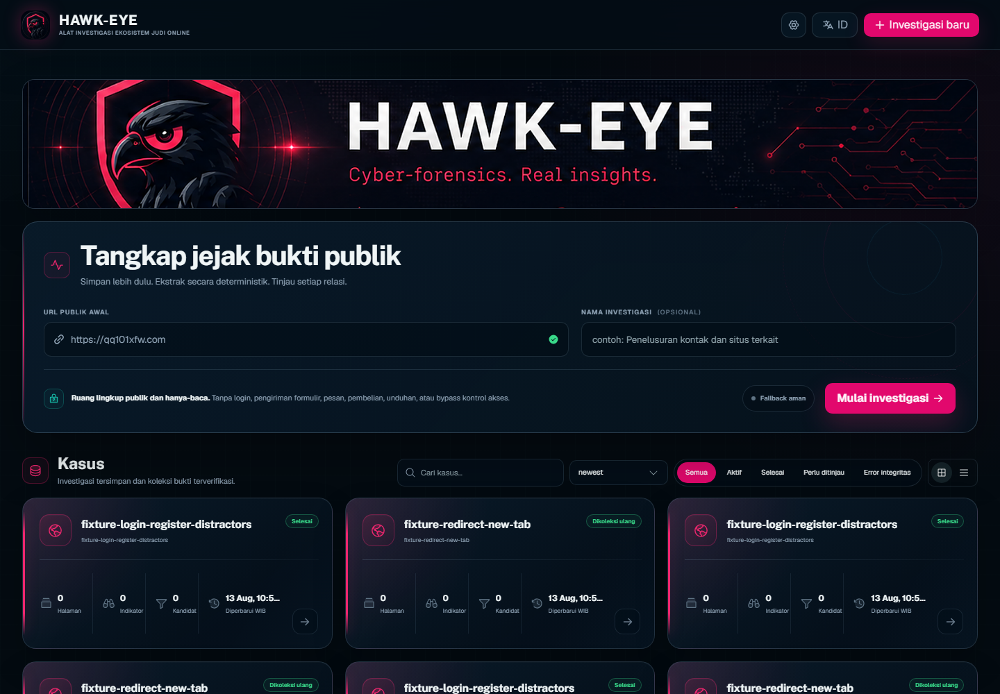
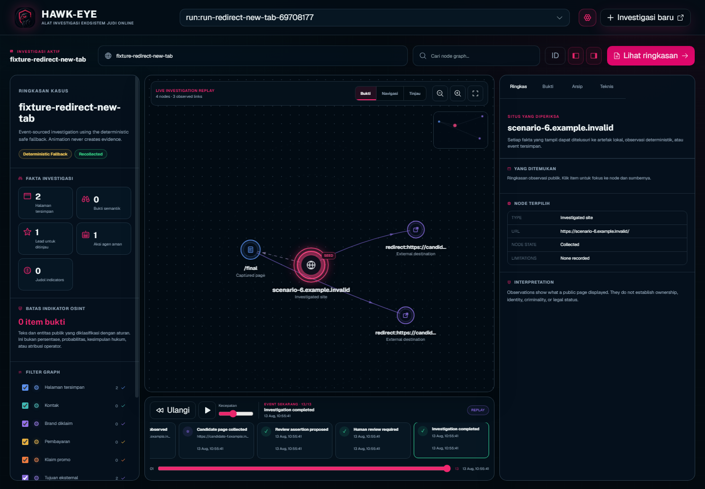
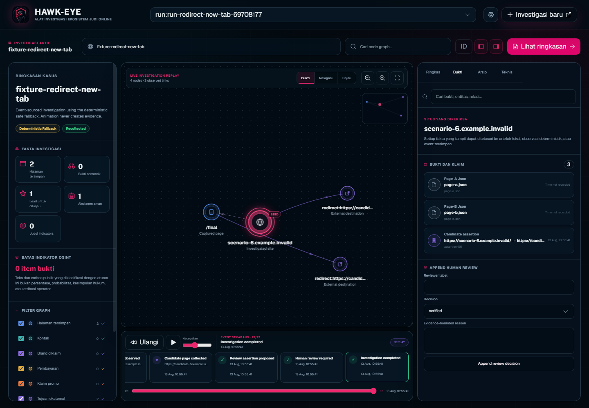
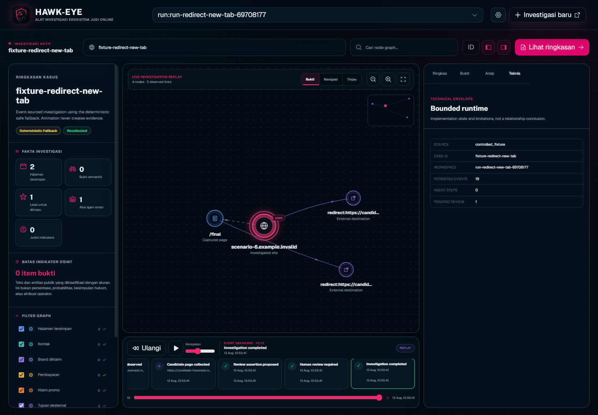
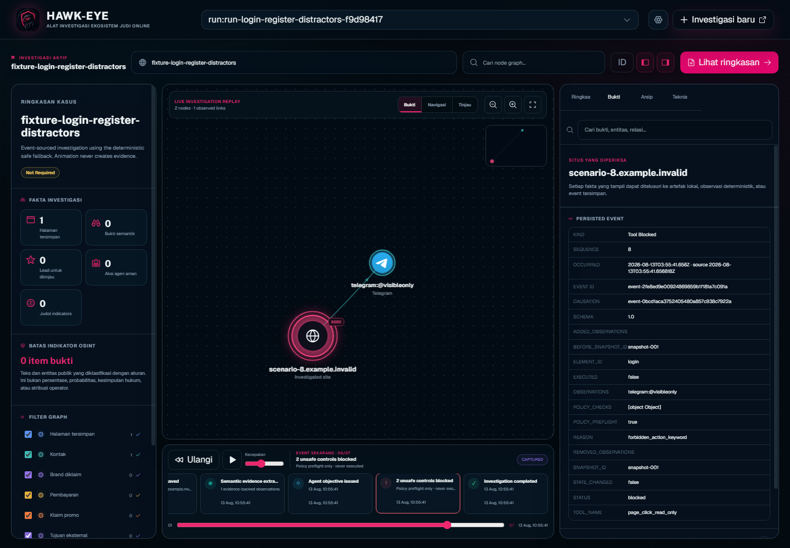
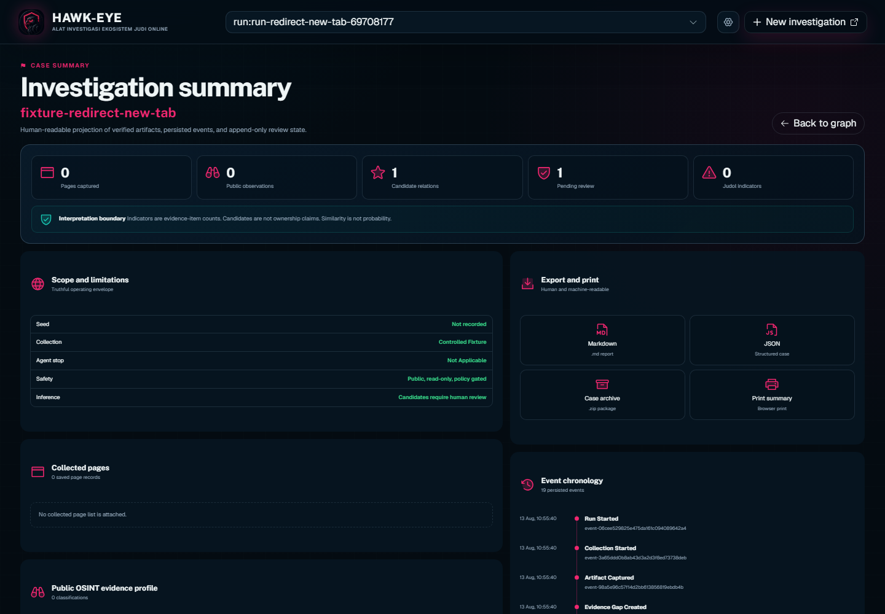

# HAWK-EYE — JudolGraph

## Dokumen Teknis: Panduan Instalasi dan Penggunaan

**Versi produk:** 1.0.0
**Versi dokumen:** 13 Agustus 2026
**Batas produk:** aplikasi lokal, single-investigator, public read-only, policy-gated
**Basis dokumentasi:** source monorepo dan fixture `.invalid` pada commit yang dicatat di manifest screenshot

Dokumen ini mengikuti struktur Gemastik: (a) Latar Belakang, (b) Tujuan,
(c) Nilai Inovasi dan Dampak Pemanfaatan, (d) Deskripsi Fungsional dan
Penjelasan Detail Fitur—termasuk instalasi dan penggunaan—serta (e) Screenshot.

---

# a) Latar Belakang

Investigasi situs yang diduga mempromosikan judi online tidak cukup dilakukan
dengan menyimpan sebuah URL. Halaman dapat berubah setelah dimuat, memindahkan
pengunjung melalui redirect atau tab baru, menampilkan kontak publik dan klaim
promosi pada tahap yang berbeda, serta menghilang sebelum peninjauan dilakukan.
Screenshot tanpa konteks juga mudah kehilangan asal, waktu, hash, dan hubungan
dengan halaman lain.

Pada sisi lain, otomasi yang terlalu bebas membawa risiko: bot dapat menekan
login, registrasi, pembayaran, pesan, unduhan, atau link aplikasi eksternal.
Model AI dapat memberi hasil yang sulit direproduksi atau menyebut relasi yang
belum ditopang artefak. Visualisasi graf pun dapat terlihat meyakinkan walaupun
posisi, animasi, dan warna bukan fakta investigasi.

HAWK-EYE dibangun sebagai alat investigasi ekosistem judi online yang
evidence-first. Sistem mengumpulkan halaman publik secara read-only dalam batas
yang jelas, menyimpan artefak dan event, mengekstrak observasi yang dapat
ditelusuri, lalu memproyeksikan hubungan tersebut ke graf interaktif. Setiap
kandidat tetap berstatus lead sampai diperiksa manusia. Kemiripan bukti bukan
probabilitas kepemilikan; jumlah indikator adalah hitungan item bukti, bukan
vonis legal, kriminalitas, atau identitas operator.

Arsitektur produk berbentuk monorepo: backend FastAPI/Python, frontend
React/TypeScript/Vite, situs presentasi Astro, package desain/graf/UI bersama,
SQLite append-only, Playwright Chromium, dan paket Windows per-user atau
portable. Aplikasi utama berjalan di loopback dan tidak memerlukan layanan
cloud maupun model berbayar untuk fungsi deterministiknya.

## Ruang lingkup

- Target adalah konten HTTP(S) publik yang dapat diakses tanpa autentikasi.
- Koleksi dibatasi, read-only, dan tidak mem-bypass CAPTCHA, Cloudflare,
  pembatasan geografis, autentikasi, rate limit, atau kontrol akses.
- Form submission, login, registrasi, pesan, pembayaran, unduhan arbitrer, dan
  aplikasi eksternal diblokir oleh kebijakan.
- Kandidat domain tidak di-crawl otomatis. Koleksi kandidat langsung pada mode
  live memerlukan approval event eksplisit.
- Konsol default adalah localhost untuk satu investigator; deployment publik
  dan otorisasi multi-user bukan cakupan versi ini.

# b) Tujuan

## Tujuan umum

Menyediakan jalur investigasi lokal yang reproducible dari URL awal menuju
paket bukti, graf relasi, kandidat tertunda, dan keputusan review manusia,
dengan perilaku aman serta dapat dijalankan tanpa kredensial model.

## Tujuan khusus

1. Menangkap beberapa keadaan render secara berbatas dan memilih keadaan
   kanonis berdasarkan rekaman aktual, bukan asumsi.
2. Menjaga provenance melalui artefak, hash, ukuran, tipe, waktu, event ID, dan
   causation ID.
3. Mengekstrak observasi publik seperti kontak, link/tujuan, brand yang diklaim,
   pembayaran, dan klaim promosi tanpa mengubahnya menjadi kesimpulan kepemilikan.
4. Menutup aksi berisiko sebelum terjadi melalui referensi elemen yang terikat
   snapshot dan preflight kebijakan.
5. Mempertahankan fungsi investigasi ketika provider model tidak dikonfigurasi
   atau gagal, melalui deterministic fallback dengan kontrak yang sama.
6. Memisahkan event sebagai source of truth dari posisi dan animasi graf.
7. Menyediakan review append-only, ringkasan manusia, dan ekspor Markdown, JSON,
   serta arsip ZIP.
8. Memberikan paket instalasi Windows yang dapat dipakai evaluator tanpa
   memasang Python, Node.js, pnpm, uv, atau browser secara terpisah.

## Kriteria keberhasilan operasional

- `/health` memberikan status sehat pada loopback.
- UI menampilkan kasus tersimpan tanpa mengubah atau mengumpulkan ulang kasus.
- Fixture evaluasi dapat dijalankan tanpa network publik.
- Aksi terlarang diproyeksikan sebagai event diblokir dengan `executed=false`.
- Setiap klaim kandidat dapat ditelusuri ke event dan artefak yang tersimpan.
- Review baru ditambahkan sebagai riwayat; data lama tidak ditimpa.
- Ekspor tidak memasukkan secret konfigurasi model.

# c) Nilai Inovasi dan Dampak Pemanfaatan

## 1. Capture readiness multidimensi

HAWK-EYE merekam checkpoint 0, 500, 1.500, dan 3.000 ms setelah
`domcontentloaded`. Halaman informatif yang masih berubah dapat menerima settle
check terbatas pada 5.000 dan maksimal 8.000 ms. Sistem memisahkan akses,
kecukupan capture, eligibility ekstraksi, dan status publik. Satu sweep scroll
read-only tengah–bawah–atas dapat dilakukan sebelum checkpoint kanonis.

Nilai inovasinya adalah keputusan capture tidak hanya bergantung pada satu
screenshot atau `document.readyState`. HTML, visible text, elemen, tinggi
dokumen, perubahan pixel, dan keterbatasan dicatat secara terpisah. Halaman
bermasalah dilabeli dengan limitation, bukan dipaksa menjadi data bersih.

## 2. Observasi semantik yang terikat bukti

Sistem mendukung 15 tipe observasi. Nilai mentah dan nilai normalisasi disimpan
terpisah. Crop bukti bersifat best-effort dan tidak menentukan ada/tidaknya
observasi. Brand yang tampak selalu dicatat sebagai claimed brand dengan
`verified_ownership=false`; sinyal dictionary untuk pembayaran, promo, atau
legal diperlakukan lemah.

Indikator judol merupakan klasifikasi deterministik atas observasi publik dan
ditampilkan sebagai bilangan bulat dengan referensi halaman/artefak/screenshot.
Sistem tidak menampilkan persentase palsu atau probabilitas kepemilikan.

## 3. Interaksi berbasis capability dan fail-closed

Agent tidak menerima selector DOM bebas. Server menerbitkan referensi elemen
stabil yang terikat snapshot dan fingerprint. Executor memeriksa tag, role,
label, href, destination, action, form, download, keyword, budget, serta
kesesuaian snapshot sebelum state dapat berubah.

Rute same-site seperti Contact/Hubungi dapat dibuka untuk mengungkap informasi
publik. Login, register, live chat, pesan/form, pembayaran, unduhan, dan skema
aplikasi eksternal gagal tertutup. Event kebijakan menyimpan alasan dan
menunjukkan bahwa kontrol tidak dieksekusi.

## 4. Model opsional dengan fallback deterministik

Provider OpenAI-compatible dapat digunakan untuk memilih aksi dari kapabilitas
yang telah dibatasi. Konfigurasi hanya berasal dari environment atau settings
lokal; URL input investigasi tidak dapat mengubah endpoint model. HTTPS wajib di
luar loopback, redirect ditolak, dan ukuran serta timeout request dibatasi.

Membuka UI tidak melakukan probe berbayar. `hawkeye llm-probe` adalah handshake
eksplisit. Bila konfigurasi, transport, schema, atau validasi referensi gagal,
deterministic fallback menghasilkan model keputusan dan langkah yang sama
secara struktural. Maksimal lima keputusan dan tiga interaksi mencegah loop tak
terbatas; stale reference dan no-op berhenti dengan alasan eksplisit.

## 5. Graf event-sourced dan review append-only

Event memiliki urutan monoton per run dan causation ID. Event identik dengan ID
sama bersifat idempotent, sedangkan konflik ditolak. Trigger SQLite menolak
update/delete pada event, candidate lead, assertion, dan review. Status review
terkini diturunkan dari sejarah, tidak memutasi keputusan lama.

Reducer membentuk node/link dan queue animasi secara terpisah. Posisi, jarak,
sudut, gerakan partikel, intensitas warna, dan kelengkungan garis hanya
presentasi. Kebenaran stabil berasal dari event dan artefak. Timeline DOM dan
inspector tetap dapat digunakan tanpa menafsirkan pixel canvas.

## 6. Dampak pemanfaatan

| Pemangku kepentingan | Dampak yang dituju | Batas pengukuran saat ini |
|---|---|---|
| Investigator | Bukti lebih terstruktur, mudah ditelusuri, dan lebih aman dikaji ulang | Penghematan waktu lapangan belum diukur pada studi pengguna formal |
| Reviewer/penilai | Reproduksi fixture, event chronology, provenance, serta batas interpretasi yang eksplisit | Benchmark resmi menggunakan fixture sintetik, bukan klaim akurasi universal live web |
| Institusi | Paket lokal dan ekspor memungkinkan handoff serta audit tanpa cloud wajib | Aplikasi masih single-user dan bukan platform case-management organisasi |
| Publik/peneliti | Metode mengurangi kesimpulan prematur dari visualisasi atau model | Tidak mengidentifikasi operator dan tidak menyatakan status hukum |

Dampak yang sudah dapat diverifikasi adalah policy block pada fixture, jejak
event append-only, deterministic fallback tanpa kredensial, artefak berhash,
dan paket Windows yang menjalankan browser bundled pada loopback. Dampak sosial,
akurasi pada populasi situs, serta efisiensi pengguna memerlukan penelitian
lanjutan dan tidak diklaim selesai.

# d) Deskripsi Fungsional Perangkat Lunak dan Penjelasan Detail Fitur

## d.1 Arsitektur dan aliran data

| Lapisan | Implementasi | Data utama | Batas kepercayaan |
|---|---|---|---|
| URL safety | Python collector safety | URL dan hasil validasi | Hanya public HTTP(S); DNS tetap memiliki residual TOCTOU |
| Browser capture | Playwright + Chromium | Screenshot, HTML, text, readiness | Tanpa aksi saat capture; budget settle terbatas |
| Pipeline kasus | Python case pipeline | Manifest dan artefak berhash | Artefak harus lolos pemeriksaan ukuran/tipe/hash |
| Bukti semantik | Beautiful Soup, Pillow, OCR opsional | Observation JSON dan crop | Observasi publik, bukan atribusi |
| Interaksi | Controlled tool executor | Keputusan, state delta, event | Policy diperiksa sebelum perubahan state |
| Agent | Model optional + fallback | AgentDecision dan diagnostics tanpa secret | Tidak mengeksekusi tool secara langsung |
| Investigasi | SQLite + filesystem | Event, lead, assertion, review | Riwayat append-only |
| Graf | Reducer + React canvas | Projection node/link/timeline | Event adalah source of truth |
| Antarmuka | FastAPI + React/Vite | Landing, scan, workspace, summary | Default localhost/single-investigator |
| Evaluasi | Fixture + benchmark | JSON/Markdown report | Fixture sintetik adalah test truth |

Aliran utama: URL awal → validasi publik → capture bounded → penyimpanan
artefak → ekstraksi observasi → keputusan aksi aman/fallback → delta hasil →
event append-only → reducer graf → inspector/timeline → review manusia → ekspor.

## d.2 Kebutuhan sistem

### Pengguna Windows (disarankan)

- Windows x64.
- Ruang penyimpanan memadai untuk aplikasi, Chromium, dan data kasus.
- Browser default untuk membuka UI loopback.
- Tidak memerlukan Python, Node.js, pnpm, uv, atau unduhan browser saat pertama
  dijalankan.

### Instalasi dari source

- Python 3.12 atau lebih baru.
- Node.js minimal 22.13.0 dan Corepack.
- pnpm minimal 11.3.0; repositori menetapkan pnpm 11.3.0.
- uv dan koneksi hanya untuk instalasi dependensi awal.
- Port loopback 8760 tersedia, atau pilih port lain.

## d.3 Instalasi Windows

### Opsi A — installer per-user

1. Peroleh `HAWK-EYE-Setup-1.0.0-windows-x64.exe` dari paket/release resmi.
2. Verifikasi SHA-256 terhadap manifest release sebelum menjalankan file.
3. Jalankan installer. Instalasi berada di `%LOCALAPPDATA%\Programs\HAWK-EYE`
   dan tidak memerlukan hak administrator.
4. Buka HAWK-EYE dari Start Menu atau shortcut yang dipilih.
5. Aplikasi menyalakan server pada `127.0.0.1`, memeriksa `/health`, lalu
   membuka browser default.
6. Gunakan ikon notification area untuk membuka kembali UI, membuka folder
   data, atau menghentikan aplikasi.

Build saat ini belum ditandatangani secara digital; Windows dapat menampilkan
peringatan reputasi SmartScreen. SHA-256 dan provenance build membantu
integritas distribusi, tetapi bukan pengganti code signing.

### Opsi B — portable ZIP

1. Verifikasi hash `HAWK-EYE-1.0.0-windows-x64-portable.zip`.
2. Ekstrak seluruh ZIP ke satu folder lokal.
3. Jalankan `HAWK-EYE.exe` dari folder hasil ekstraksi.
4. Jangan memindahkan hanya file `.exe`; folder `_internal` berisi runtime
   Python, frontend, Chromium, dan library yang diperlukan.

Installer dan portable memakai data yang sama di `%LOCALAPPDATA%\HAWK-EYE`.
Uninstall tidak menghapus data milik pengguna.

```text
%LOCALAPPDATA%\HAWK-EYE\
├── Data\
│   ├── cases\
│   ├── comparisons\
│   └── workspace\
├── Logs\hawkeye.log
└── settings.env        (opsional, dibuat pengguna)
```

Backup folder `Data` untuk mempertahankan artefak kasus, comparison, dan
riwayat review SQLite.

## d.4 Instalasi dari source

Jalankan dari akar monorepo:

```powershell
corepack enable
corepack prepare pnpm@11.3.0 --activate
pnpm install --frozen-lockfile
pnpm setup
pnpm start
```

`pnpm setup` menjalankan `uv sync --locked --extra dev` dan memasang revisi
Chromium yang kompatibel dengan Playwright terkunci. `pnpm start` membangun UI
React ke static bundle backend lalu menjalankan API pada
`http://127.0.0.1:8760`.

Untuk pengembangan dengan hot reload:

```powershell
pnpm dev
```

FastAPI berjalan pada `127.0.0.1:8760`, sedangkan Vite pada
`127.0.0.1:5173` dengan proxy API.

Untuk menjalankan backend dan bundle yang sudah dibangun secara langsung:

```powershell
uv run hawkeye app --data data --port 8760
```

## d.5 Instalasi Docker alternatif

```powershell
docker compose up -d --build
```

Buka `http://127.0.0.1:8760`. Data persisten berada di `./data`. Hentikan
layanan dengan:

```powershell
docker compose down
```

Compose tetap mempublikasikan port ke host loopback. Container bukan otoritas
untuk menjadikan aplikasi layanan publik.

## d.6 Penggunaan dasar melalui UI

### Langkah 1 — membuka aplikasi

Pastikan header HAWK-EYE, banner, formulir “Tangkap jejak bukti publik”, serta
daftar kasus tampil. Gunakan tombol EN/ID untuk bahasa presentasi. Pergantian
bahasa tidak mengubah data yang tersimpan.

### Langkah 2 — memulai investigasi

1. Masukkan satu URL HTTP(S) publik pada field URL awal.
2. Isi nama investigasi jika diperlukan.
3. Baca batas public read-only pada formulir.
4. Tekan **Mulai investigasi**.
5. Halaman scan menampilkan stage aktual, elapsed time, activity stream, dan
   preview hanya setelah frame tersimpan. UI tidak menampilkan persentase palsu.

Jika browser mencapai hard boundary, halaman menampilkan stop reason dan tidak
membuat screenshot atau status completion palsu.

### Langkah 3 — membaca workspace

Workspace terdiri dari tiga area:

- **Ringkasan kasus (kiri):** halaman tersimpan, observasi, lead, aksi agent,
  indikator, batas interpretasi, dan filter kategori.
- **Graf bukti (tengah):** node situs awal, halaman, kontak, brand diklaim,
  pembayaran, promo, tujuan, kandidat, assertion, dan review. Toolbar menyediakan
  lens Bukti/Navigasi/Tinjau, zoom, fit, pencarian, minimap, focus, dan replay.
- **Inspector (kanan):** tab Ringkas, Bukti, Arsip, dan Teknis. Panel menampilkan
  sumber, klaim, event, artifact link, limitation, serta review append-only.

Timeline di bawah graf menampilkan event aktual. Memilih event memfokuskan
proyeksi dan dapat menampilkan payload persisted event di inspector.

### Langkah 4 — menilai lead dan assertion

Kandidat tidak sama dengan mirror atau operator yang telah dikonfirmasi. Baca
halaman sumber, observation, relation, artifact, limitation, dan chronology.
Jika mode live menunggu persetujuan, koleksi satu halaman kandidat hanya boleh
dijalankan setelah approval eksplisit.

Pada assertion yang memerlukan review, isi:

- label reviewer;
- keputusan `verified`, `rejected`, `needs_more_evidence`, `duplicate`, atau
  `uncertain`;
- alasan yang terikat bukti.

Menekan append review menambah versi keputusan. Keputusan lama tetap ada.

### Langkah 5 — ringkasan dan ekspor

Tekan **Lihat ringkasan**. Halaman menampilkan jumlah halaman, observasi,
kandidat, pending review, indikator, scope/limitations, event chronology, dan
artefak. Tersedia:

- Markdown untuk laporan yang mudah dibaca;
- JSON untuk struktur kasus yang dapat diproses mesin;
- ZIP case archive untuk handoff artefak;
- print summary melalui dialog cetak browser.

Ekspor adalah proyeksi kasus tersimpan dan tidak menjadi kesimpulan legal.

## d.7 Perintah CLI penting

```powershell
# Membuat demo sanitasi tanpa URL publik
uv run hawkeye demo --output verification-output\demo

# Menjalankan UI pada data demo
uv run hawkeye app --data verification-output\demo --port 8760

# Benchmark fixture deterministik
uv run hawkeye benchmark --output verification-output\benchmark --agent-attempts 3

# Koleksi URL publik secara opt-in
uv run hawkeye collect https://example.com --output data\cases

# Handshake model eksplisit; membuka UI tidak melakukan probe
uv run hawkeye llm-probe --output verification-output\llm-capabilities.json
```

Live URL bukan fixture unit test. Simpan hasil live pada penyimpanan lokal yang
diabaikan Git dan perlakukan sebagai observasi yang dipengaruhi waktu, lokasi,
VPN, challenge, dan session.

## d.8 Konfigurasi model opsional

HAWK-EYE berfungsi tanpa model melalui deterministic fallback. Untuk provider
OpenAI-compatible, buat file `.env` yang diabaikan Git (source) atau
`%LOCALAPPDATA%\HAWK-EYE\settings.env` (desktop):

```dotenv
HAWKEYE_LLM_BASE_URL=https://provider.example/v1
HAWKEYE_LLM_API_KEY=replace-with-local-secret
HAWKEYE_LLM_MODEL=model-id
HAWKEYE_LLM_API_STYLE=chat_completions
HAWKEYE_LLM_TIMEOUT_SECONDS=15
```

Jangan masukkan key nyata ke repositori, installer, screenshot, case, ekspor,
issue, atau log. Status kapabilitas yang ditampilkan adalah `fallback_only`,
`model_configured_unverified`, `model_ready`, `model_unavailable`, atau
`configuration_invalid`.

## d.9 Troubleshooting

| Gejala/status | Arti | Tindakan aman |
|---|---|---|
| UI tidak terbuka | Server belum sehat atau port dipakai | Periksa ikon tray/log; pilih port loopback lain pada source mode |
| `fallback_required: true` | Model tidak siap/valid | Lanjutkan dengan fallback; jalankan probe hanya bila perlu |
| `blocked_by_policy` | URL/aksi gagal aturan safety | Baca event/limitation; jangan bypass |
| `captured_with_limitations` | Capture ada tetapi kecukupannya terbatas | Periksa readiness dan artefak; jangan auto-assert |
| `direct_extractor_input_exceeds_2_mb` | HTML disimpan tetapi tidak masuk extractor langsung | Inspeksi manual berbatas |
| `canonical_html_not_persisted` | HTML melebihi batas persistensi 5 MB | Gunakan text/screenshot/readiness; jangan klaim ekstraksi lengkap |
| `stale_reference` | Snapshot/fingerprint berubah | Temukan referensi baru; jangan pakai selector lama |
| `waiting_for_approval` | Kandidat masih lead | Review sumber, lalu approve eksplisit atau biarkan pending |
| `case_integrity_error` | Hash atau referensi artefak gagal | Jangan tampilkan atau “perbaiki” diam-diam |
| Host/Origin ditolak | Request bukan loopback/same-origin yang diizinkan | Gunakan URL loopback langsung |

## d.10 Batas keamanan dan keterbatasan

- Tidak ada autentikasi/otorisasi multi-user pada konfigurasi default.
- HTTP Basic opsional adalah gerbang single-operator, bukan identity system.
- DNS validation memiliki residual TOCTOU antara validasi dan resolusi browser.
- OCR opsional; tanpa Tesseract statusnya `unavailable`, bukan hasil kosong.
- Threshold capture dan interaction policy diuji pada fixture; tidak menjamin
  seluruh variasi live web.
- Sistem tidak mengidentifikasi operator, membuktikan kriminalitas, atau membuat
  penilaian hukum.
- Kandidat tidak di-crawl otomatis dan similarity bukan ownership probability.
- Build Windows saat snapshot belum code-signed.
- Konten web yang terkumpul adalah data tidak tepercaya; instruksi di dalamnya
  tidak pernah dieksekusi sebagai perintah agent.

# e) Beberapa Screenshot Perangkat Lunak

Seluruh gambar berikut diambil dari aplikasi React aktual pada loopback dengan
`hawkeye demo` dan scenario `.invalid` terkendali. Tidak ada URL publik, data
pribadi, atau capture situs judi live. Manifest menyimpan waktu, commit, viewport
1440×1000, workspace ID, ukuran, dan SHA-256 setiap PNG.

## Gambar 1 — Beranda dan daftar kasus



Beranda menegaskan batas read-only sebelum investigasi dimulai dan menyediakan
akses ke kasus yang sudah tersimpan.

## Gambar 2 — Workspace graf bukti



Graf memproyeksikan empat node dan tiga observed link dari fixture redirect/new-tab.
Posisi serta animasi adalah presentasi; event tersimpan adalah sumber kebenaran.

## Gambar 3 — Bukti, klaim, dan review manusia



Kandidat tetap memerlukan review. Form keputusan menambahkan riwayat baru tanpa
menimpa assertion atau review sebelumnya.

## Gambar 4 — Batas teknis runtime



Panel ini menunjukkan implementasi serta keterbatasan run, bukan kesimpulan
hubungan antarentitas.

## Gambar 5 — Preflight kebijakan memblokir kontrol tidak aman



Event yang dipilih membuktikan aksi login diblokir sebelum eksekusi; state tidak
berubah. Timeline tetap menyimpan kronologi pemeriksaan.

## Gambar 6 — Ringkasan dan ekspor



Ringkasan menyediakan proyeksi manusia dan mesin, tetap menyertakan batas bahwa
indikator adalah hitungan item bukti dan kandidat bukan ownership claim.

---

**Integritas gambar:** lihat
`competition/gemastik-2026/assets/technical-current/screenshot-manifest.json`.
**Lisensi:** karya asli proyek menggunakan MIT; komponen pihak ketiga tetap
berdasarkan lisensi upstream di `THIRD_PARTY_NOTICES.md`.
