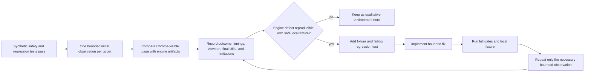

# JudolGraph — Product and GEMASTIK XIX/2026 Requirements

> Status: specification and submission-planning source of truth, 3 August 2026. This document does
> not claim that the product already satisfies every requirement below. Product implementation
> evidence remains in `IMPLEMENTATION_STATUS.md` and `CLAIM_EVIDENCE_MATRIX.md`.

## 1. Source authority and interpretation

### Official competition sources

- [Penawaran GEMASTIK 2026 — Kemdiktisaintek](https://kemdiktisaintek.go.id/announcement/article/penawaran-gemastik-2026)
- [Panduan GEMASTIK XIX Tahun 2026 — official linked guide](https://drive.google.com/file/d/1ntd2hBOC9Way3bTC3LnCIX04I1_ylCim/view?usp=sharing)
- [Portal Kompetisi Cerdas](https://kompetisicerdas.kemdiktisaintek.go.id/gemastik/)

The official guide is authoritative for competition requirements. Product and UI requirements in
Sections 7–14 are project decisions intended to satisfy the brief and judging rubric; they are not
presented as rules issued by GEMASTIK.

If the portal or a later organizer announcement conflicts with this document, use the newer official
source and update this Markdown before submission. One ambiguity already needs human confirmation:
the general rules allow a previously winning work after more than 50% development and a declaration,
while the Software Development special rules say the work must never have been declared a winner in
a similar competition. Apply the stricter software-specific rule unless the organizer clarifies it.

## 2. Eligibility and administration

The team must verify all of the following before upload:

- The institution is under Kemdiktisaintek and registered in PDDIKTI.
- Every participant is an active diploma or undergraduate student in PDDIKTI through the final and
  awards stages.
- The team contains at most three students: one chair and up to two members.
- Participant names exactly match PDDIKTI and the uploaded identity/active-student documents.
- The institution has not exceeded the preliminary quota of ten teams in the category and understands
  that at most three of its teams can become finalists.
- No team member is disqualified by the same-category gold-medalist restriction.
- The team and institution administrator complete registration and delegation documents in the
  official portal.
- An authorized human confirms originality, publication history, previous-competition history,
  licenses, signatures, and stamp-duty requirements. The repository must not invent these facts.

## 3. Official 2026 schedule

| Activity | Date stated in the guide | Project action |
|---|---|---|
| Registration and proposal upload window | 27 July–14 August 2026 | Finish human metadata, source verification, and upload package before the portal deadline |
| Preliminary assessment | 15 August–2 September 2026 | Preserve the exact submitted commit and artifact hashes |
| Finalist announcement | First week of September 2026 | Monitor only through an authorized human account |
| Finalist re-registration | 26–30 October 2026 | Prepare final administrative package if selected |
| Final and GEMASTIK peak | 10–13 November 2026 | Software Development final is online; prepare presentation, Q&A, and full demo |

Dates must be rechecked against the portal immediately before submission because the guide permits
organizer updates.

## 4. Preliminary submission package

### 4.1 Originality declaration

- Original work, no plagiarism or copyright infringement, and compliant competition history.
- Signed by the team chair with the required stamp duty.
- PDF, maximum 2 MB.
- Human-owned information must remain marked `TODO — requires human confirmation` until confirmed.

### 4.2 Design and software video

- Maximum three minutes.
- Demonstrate the design process and software at a minimum of 50% implementation.
- Explain why the product is useful and how a user operates it.
- Screen recording, emulator recording, or real-device recording is allowed.
- Upload to YouTube and include the link with the proposal upload.
- Title format:
  `GEMASTIK XIX Perangkat Lunak - <ID-Tim> - <Nama Tim> - <Judul Karya>`.

### 4.3 Deliverables archive

The ZIP/RAR and its root folder must use:

```text
GEMASTIK XIX Perangkat Lunak - <ID-Tim> - <Nama Tim> - <Judul Karya>
```

The archive must contain:

1. Proposal PDF with at least 50% implementation demonstrated.
2. Technical documentation, maximum 30 pages, including background, objective, innovation and
   impact, functional/feature description, screenshots, installation, and usage.
3. A runnable application: URL for a web application or executable for a desktop application.
4. A TXT or DOCX file containing the demo-video URL.
5. A list of libraries/components and their licenses.
6. The signed originality declaration.
7. The adopted software license.

The software must run on a common platform without special hardware. One team may submit only one
work. Incremental work must disclose and demonstrate the update.

## 5. Proposal requirements

### 5.1 Exact official section order

```markdown
# [NAMA PRODUK FINAL]

## 1. Judul/Nama Perangkat Lunak
## 2. Latar Belakang Ide Perangkat Lunak
## 3. Tujuan dan Manfaat Dikembangkannya Perangkat Lunak
## 4. Batasan Perangkat Lunak yang Dikembangkan
## 5. Metodologi Pengembangan Perangkat Lunak
## 6. Analisis Kebutuhan dan Desain Solusi Perangkat Lunak
## 7. Implementasi Perangkat Lunak
## 8. Screenshot Mockup Interface Perangkat Lunak
## 9. Dokumentasi Cara Penggunaan Perangkat Lunak
```

### 5.2 File and size rules

- Maximum 30 pages in total, including attachments and content counted by the organizer.
- Proposal PDF maximum 10 MB.
- Filename:
  `GEMASTIK XIX Perangkat Lunak - <ID Tim> - <Nama Tim> - <Judul Karya> - Proposal.pdf`.
- Project target: 24–27 rendered pages, leaving margin below the hard limit.
- Do not create a submission-ready PDF until citations, claims, screenshots, page count, and human
  declarations are verified.

### 5.3 Required content quality

The proposal must show that the idea is original, realizable, innovative, creative, and at least 50%
implemented. It must compare the product against similar software across the judging criteria rather
than assert uniqueness without evidence. The impact case must be supported by verified data, not
argument alone. The product must be operable and its proposed impact measurable.

The proposal must not fabricate interviews, usability participants, benchmark results, deployment
history, team details, signatures, originality, legal conclusions, or licenses.

## 6. Judging alignment

### Preliminary

| Criterion | Weight | Required JudolGraph evidence |
|---|---:|---|
| Innovation | 20% | Evidence-provenance chain, explicit access/capture adequacy, bounded AI with deterministic fallback, event-first graph |
| Expected impact and sustainability | 20% | Measurable target workflow, user-validation plan, local/offline demo, realistic operating model |
| UI, usability, and UX | 20% | Complete investigator journey, legible evidence states, keyboard/reduced-motion support, usability findings |
| Development process and methodology | 20% | Milestones, ADRs, source history, tests, benchmarks, real-site diagnostic loop, limitations |
| Idea/software alignment | 10% | Working capture → evidence → lead → assertion → review → graph path |
| Problem urgency | 10% | Current authoritative Indonesian sources and a neutral, non-prejudicial problem statement |

### Final, if selected

- Final report and similarity result at or below 25%.
- IEEE-format paper and similarity result at or below 25%.
- Proof of intellectual-property registration, at minimum the organizer-specified recording/DJKI
  evidence.
- 100% final product video, presentation, and working demo; source code ready if judges request it.
- Final score: presentation 45%, Q&A/jury challenge response 45%, preliminary score 10%.

## 7. Product definition

JudolGraph is a localhost evidence workspace for bounded investigation of public web pages. Its job
is not to decide that a website, person, or organization is illegal or shares ownership. Its job is
to preserve what was publicly observable, expose capture limitations, distinguish a lead from an
assertion, require human review, and show the causal evidence path in a progressive graph.

The core product sentence is:

> From a public page to a reviewable relationship—every step retains its evidence, boundary, and
> event history.

This is an MVP with no backward-compatibility requirement. Breaking schema, storage, and UI changes
are allowed when they produce a more coherent preliminary product. Preserve frozen Git history and
truthful evidence artifacts, but do not spend product time supporting obsolete pre-MVP payloads,
screens, or case formats. A clean local data reset is acceptable when documented.

### Non-negotiable language

- A candidate URL is a pending lead, not a confirmed mirror or operator.
- Similarity is evidence similarity, not ownership probability.
- `verified` means a human accepted the stated evidence relationship; it does not prove criminality,
  ownership, or legal status.
- Live-site outcomes are time/session/location-dependent observations, not universal facts.

## 8. End-to-end product graph

```mermaid
flowchart LR
    U["User enters one public seed"] --> P["URL and network safety policy"]
    P --> C["Bounded Playwright capture"]
    C --> R["Fixed readiness checkpoints"]
    R --> A["Access outcome and capture adequacy"]
    A -->|"eligible"| S["Semantic observations with provenance"]
    A -->|"limited or failed"| L["Visible limitation and diagnostic evidence"]
    S --> G["Explicit evidence gap"]
    G --> D{"Codex capability available?"}
    D -->|"yes"| M["Schema-valid bounded decision"]
    D -->|"no"| F["Deterministic fallback"]
    M --> X["Server-side interaction policy"]
    F --> X
    X -->|"allowed public reveal"| O["Narrow interaction executor"]
    X -->|"blocked"| B["Blocked-action event"]
    O --> E["New observation or direct candidate lead"]
    E --> H{"Real candidate?"}
    H -->|"yes"| Q["Stop: human approval required"]
    H -->|"controlled fixture"| PB["Recollect Page B"]
    Q -->|"authorized bounded run"| PB
    PB --> AR["Candidate assertion with Page A and Page B evidence"]
    AR --> HR["Human verifies or rejects"]

    C --> EV["Append-only event and artifact store"]
    S --> EV
    L --> EV
    B --> EV
    E --> EV
    PB --> EV
    AR --> EV
    HR --> EV
    EV --> GR["Idempotent graph reducer"]
    GR --> UI["Graph, timeline, evidence inspector, and review history"]
```



The append-only store, not the animation, is the source of truth. Refresh and replay must rebuild the
same graph state.

## 9. WebGraph UI/UX reference audit

References inspected:

- [WebGraph live application](https://webgraph.kitaaura.com/)
- [kitakitaaura/webgraph source repository](https://github.com/kitakitaaura/webgraph), reviewed at
  commit `29449ee37746bf8e68f03c08659a2f58709079e3`

The source is a small vanilla HTML/CSS/JavaScript interface over a Python server. A full-window 2D
canvas owns graph drawing and hit testing; client state holds nodes, edges, filters, selection,
timeline, camera, and replay state. Live crawl events arrive through an `EventSource` endpoint as
metadata, node, edge, error, and completion messages. Responsive CSS changes the three floating
desktop regions into stacked mobile sections. These are useful implementation references, not code
to copy wholesale.

### Patterns worth adapting

- **Graph-first hierarchy.** The central canvas owns most of the viewport; supporting details remain
  available without navigating away.
- **One obvious input and action.** A URL field and primary scan action form a clear entry point.
- **Persistent intelligence summary.** The left panel gives an immediate overview and filterable
  layer counts.
- **Contextual inspector.** The right panel changes with node selection and avoids opening a separate
  detail page.
- **Timeline controls and minimap.** Replay, pause, speed, and spatial orientation help explain a
  changing graph.
- **Dark, high-contrast graph surface.** Color and glow can clarify clusters when labels and statuses
  remain readable.

### Patterns not to copy

- Do not add 3D, sphere, or decorative layout modes. They do not improve evidence comprehension and
  are explicitly outside this MVP.
- Do not put every image, script, font, and network request in the primary graph. Raw request detail
  belongs in an inspector; the main graph should show meaningful investigation entities.
- Do not show an opaque risk score. Every status must link to evidence and limitations.
- Do not use glass effects where they reduce contrast or make dense evidence harder to scan.
- Do not imply an unbounded live crawl or fake streaming progress.
- Do not offer export formats until each export is faithful to stored state and verified.
- Do not copy WebGraph's live-to-demo fallback semantics. Its client can call a generated demo scan
  when `EventSource` is unavailable, the crawler fails, or no nodes arrive after roughly 4.5 seconds.
  JudolGraph must never attach plausible synthetic nodes to a real URL. It must display the truthful
  `endpoint unavailable`, `timeout`, or `collection failed` state and retain diagnostics. Synthetic
  data is allowed only inside an unmistakably labeled controlled fixture case.

### JudolGraph adaptation

| WebGraph concept | JudolGraph version |
|---|---|
| Site Intel | Case Intel: seed, run, access outcome, adequacy, limitations, observation count |
| Layer toggles | Evidence filters: pages, observations, leads, assertions, reviews, blocked actions |
| Central web graph | Causal evidence graph with uncertainty encoded in edge style and labels |
| Node Inspector | Evidence Inspector: artifact preview, source selector, normalized/raw value, hashes, limitations |
| Replay controls | Investigation event timeline with play, pause, step, speed, and reduced-motion mode |
| URL scan bar | One public URL input and `Scan`; bounded behavior is stated in Site Intel/status |
| Cluster statistics | Review queue, adequacy status, provenance completeness, blocked-action count |

## 10. Required screens and interaction flow

The preliminary product must support this complete journey without requiring CLI knowledge:

```text
case list
→ create case
→ enter one public seed or select a reserved walkthrough
→ collect
→ inspect access and capture adequacy
→ inspect artifacts and semantic observations
→ start bounded expansion
→ inspect agent/fallback and policy timeline
→ inspect a candidate lead
→ approve reserved approval-gated fixture recollection when required
→ inspect Page B capture
→ inspect candidate assertion and both evidence sides
→ verify or reject with a review note
→ replay the graph transition
```

### Recommended desktop composition

```text
┌──────────────────────────────── URL / case / Investigate safely / mode ────────────────────────────────┐
│                                                                                                         │
│  Case Intel                    Causal evidence graph                         Evidence Inspector          │
│  - access outcome              - meaningful entities only                   - selected node/edge        │
│  - capture adequacy            - dashed candidate edges                     - artifact preview          │
│  - checkpoint readiness        - solid reviewed edges                       - raw/normalized value       │
│  - filters and counts          - focused causal path                         - provenance and hash        │
│  - limitations                 - minimap                                     - limitations and review    │
│                                                                                                         │
├──────────────────────────────── Event timeline / replay / blocked actions ─────────────────────────────┤
└─────────────────────────────────────────────────────────────────────────────────────────────────────────┘
```

On smaller screens, Case Intel, graph, and Evidence Inspector stack while the current critical
status remains visible.

## 11. Required UI states

Every state below must have a distinct title, explanation, next action, and machine-readable status.
Color alone is insufficient.

| State | User-facing requirement |
|---|---|
| Empty | Explain what a safe investigation does and offer controlled examples |
| Collecting | Show the current checkpoint and bounded budget without fake percentages |
| Adequate | State why extraction is eligible and expose the canonical artifact |
| Limited | Show which evidence exists and which requirement was not met |
| Failed | Preserve diagnostics and provide a safe retry action |
| Blocked action | Name the policy class and show that the action was not executed |
| Endpoint unavailable | Explain the failed capability without presenting it as a model result |
| Deterministic fallback active | Persistent, obvious badge and explanation |
| Candidate waiting for approval | Separate lead metadata from an explicit approval control |
| Recollection failed | Keep the lead pending and preserve the failure event |
| Review required | Show evidence from Page A and Page B side by side |
| Verified | Show reviewer, time, version, rationale, and solid evidence edge |
| Rejected | Preserve prior versions and show rejection rationale |

The UI must never make an empty controlled case look like a finished investigation. The local live
workspace prefers the saved QQ observation requested by the owner; the official sanitized demo
opens a populated fixture case. The evidence selector also exposes **New safe review
walkthrough…** without placing fixture counters or test-harness cards on the primary screen.

## 12. Real-domain feedback loop

The supplied domains are required qualitative product diagnostics after synthetic safety gates pass;
they are not CI fixtures or official demo dependencies.

### Owner-supplied target set

**International / multi-jurisdiction observations**

- `https://888.com/`
- `https://888casino.com/`
- `https://888poker.com/`
- `https://888sport.com/`
- `https://betfair.com/`
- `https://paddypower.com/`
- `https://skybet.com/`
- `https://skyvegas.com/`
- `https://bet365.com/`
- `https://williamhill.com/`

**Indonesian-facing public-site observations**

- `https://qq101xfw.com/`
- `https://qq888bet4cv.com/`

Use `888.com` only as an optional direct-public-link robustness example. Do not label the first set
as “US sites.”

### Mandatory loop



For each site, record one of:

```text
captured
captured_with_limitations
blocked_by_policy
access_challenge_observed
geo_restriction_observed
unavailable
timeout
collection_failed
```

Rules: no login, registration, account creation, messages, forms, transactions, downloads, CAPTCHA
bypass, VPN/geo experimentation, or automatic Page B recollection. Chrome with the user's existing
session/VPN may be used only for qualitative visible comparison; Python Playwright must not be
assumed to inherit Chrome extensions or session state. Raw captures stay in ignored local storage.
Sanitize any proposal screenshot and never publish sensitive artifacts.

### Minimum acceptance evidence

- A dated matrix for all 12 targets with final visible URL, access outcome, adequacy, artifact list,
  limitations, and Chrome/engine comparison.
- The historical false positives are no longer hidden: sparse 888/888sport, Betfair/Paddy restriction
  pages, Sky location restriction, blank bet365 challenge, and large 888casino HTML must resolve to
  truthful statuses and retained evidence.
- The `qq` timing behavior is represented by a local fixture reproducing blank initial state and
  substantive delayed render; the canonical capture must not prematurely finalize at 0/500 ms.
- Any engine change motivated by a live site has a safe local regression fixture before it is merged.
- No live-site result is described as a legal, criminal, ownership, or network conclusion.

## 13. MVP acceptance gates

### Engine and evidence

- Capture waits through the fixed readiness schedule and promotes a truthful canonical artifact.
- Access outcome, capture adequacy, and extraction eligibility are separate fields.
- Large HTML does not erase screenshot, visible text, response metadata, size, hash, or limitations.
- Semantic observations retain source artifact, selector/context, screenshot/crop, method, strength,
  confidence, and limitation.
- Exactly ten controlled interaction scenarios cover both permitted reveal and prohibited action.
- Prohibited controlled actions have a 100% server-side block rate.
- Codex use is capability-gated, schema-valid, bounded, and non-authoritative; deterministic fallback
  is an explicit product mode.
- Deterministic agent fallback may choose among stored, policy-approved actions; it must never
  replace failed real collection with generated evidence or a synthetic graph.
- A real candidate remains pending until explicit approval; no automatic candidate crawling occurs.
- Assertion, review, and investigation events are append-only and replayable.

### UI and demo

- A first-time judge can run a populated controlled example in one click.
- The complete journey in Section 10 works through the UI.
- Evidence and limitation states are readable without relying on color or animation.
- Selecting a graph entity exposes the exact supporting artifact and provenance.
- Review shows Page A and Page B evidence together and preserves version history.
- Refresh/replay produces the same graph; reduced motion preserves all information.
- Localhost, Host-header, same-origin, CSP, inert-artifact, and no-CORS boundaries remain enforced.
- The official demo is deterministic and does not depend on live URLs, VPN, Codex, or paid search.
- No backward-compatible pre-MVP case/schema support is required; test and document the clean MVP
  path instead.

### Verification

- Formatter, linter, type checker, full automated tests, UI syntax/build tests, and relevant local
  demo all pass from a clean checkout.
- Real-site observations and sanitized screenshots are reviewed separately from synthetic benchmark
  truth.
- Every proposal claim maps to a repository file, raw result, screenshot, authoritative citation, or
  clearly marked TODO.

## 14. Human-owned work still required

- Final product name, team name/ID, member names, institution, advisor, and signatures.
- Confirmation of originality, prior publication, previous competitions, and intellectual-property
  status.
- Current Indonesian problem-urgency and impact sources.
- User interviews/usability study and measurable impact baseline; until performed, do not claim them.
- Exact dependency versions and authoritative license verification.
- Final sanitized screenshots, three-minute video, YouTube visibility, file sizes, and upload archive.
- Portal and organizer confirmation of dates, proposal template availability, and the competition-
  history ambiguity noted in Section 1.

## 15. Definition of preliminary-product done

“Done” does not mean that files exist or tests pass in isolation. The preliminary product is done
only when a reviewer can start from a meaningful example, understand the capture status, trace an
observation to its artifact, see why a bounded interaction was permitted or blocked, distinguish a
lead from an assertion, review evidence from both pages, verify or reject it, and replay the exact
graph change—while the repository truthfully documents the real-site diagnostic results and every
remaining submission TODO.
