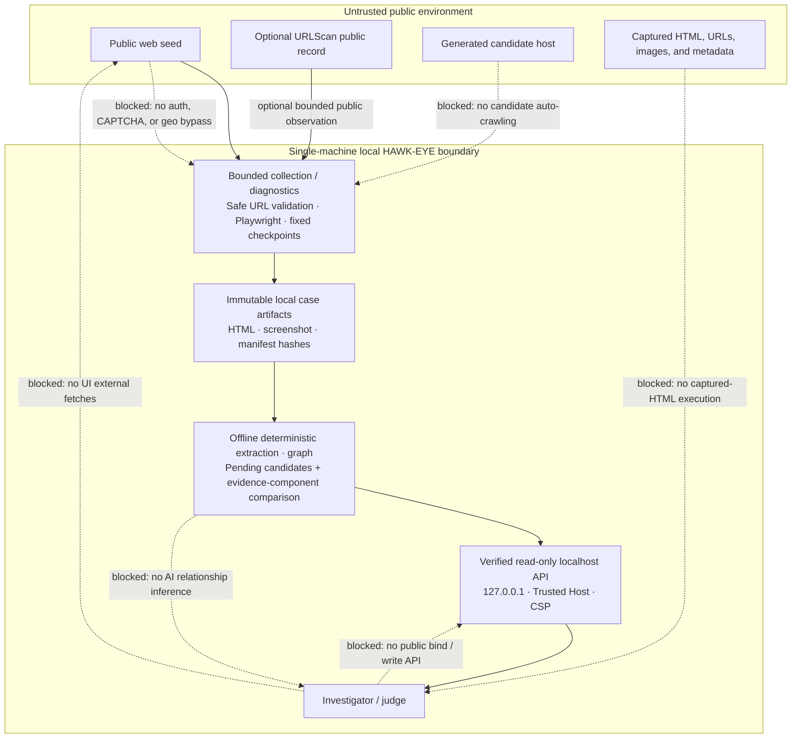

# Implemented threat model

This diagram describes the frozen `gemastik-g2` implementation targeted by
`e55c1610c4e5a0a31891e3a69944aa1ffe2648ac`. It is not a deployment architecture or a claim that
all risk is eliminated.

## Trust boundaries and controls

| Threat or ambiguity | Implemented mitigation | Residual limit / honest interpretation |
| --- | --- | --- |
| SSRF, private targets, unsafe redirects | Safe HTTP(S) validation, DNS checks, intercepted-request revalidation, default-port policy, and bounded browser requests | Chromium resolves a hostname independently after validation. DNS TOCTOU is a documented residual risk, not eliminated protection. |
| Candidate-domain expansion | Candidates are deterministic `pending` output and never return to the collector automatically | A human may independently decide what to investigate; HAWK-EYE does not authorize or automate that step. |
| Path traversal, symlinks, or tampered artifacts | Case loader requires opaque IDs, containment, regular files, hash checks, bounded sizes, and schema/reference validation | Local disk trust and operating-system access still matter. Invalid packages are rejected rather than partially displayed. |
| Stored XSS and hostile evidence | Captured HTML is a `text/plain` attachment; display values are bounded/redacted text; UI uses local assets and strict CSP | A reviewer may still open an attachment outside the console; the application does not execute it. |
| Misleading similarity language | Fixed component breakdown, **Evidence-similarity score**, and **Review status: needs review** | A numeric score is not ownership probability, mirror confirmation, criminality, or legal proof. |
| Provenance loss | Entities, graph edges, lead reasons, and comparison components retain evidence references; G2 makes them directly inspectable | A reference can be absent or corrupt; the verified loader or UI shows an integrity warning rather than inventing support. |
| External-source observations treated as fact | The single URLScan adapter is bounded and produces pending observations only | Public-source data can be stale or incomplete and never proves a relationship. |
| Local-console DNS rebinding / Host attacks | Loopback-only bind, TrustedHost middleware, ignored forwarded host, no CORS, and no proxy mode | The console is intentionally single-machine; public binding and multi-user use need a new security design. |
| CAPTCHA, authentication, or geographic restrictions | No login, form submission, CAPTCHA solving, geo bypass, stealth behavior, or user-agent impersonation | Restricted captures remain evidence of the observed restriction state, not usable target-content evidence. |

## Explicit non-goals in the current pipeline

- No candidate auto-crawling, captured-HTML execution, UI external fetches, public bind, write API,
  authentication/CAPTCHA/geo bypass, or AI relationship inference.
- No ownership, mirror, criminal-network, legal-status, or probability conclusion.
- No claim that live page behavior, browser state, or an isolated diagnostic determines the canonical
  truth of a page.
