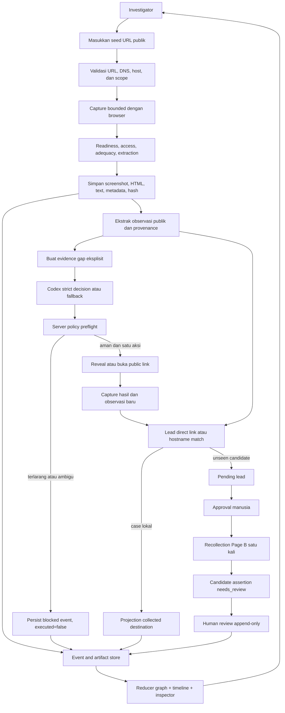
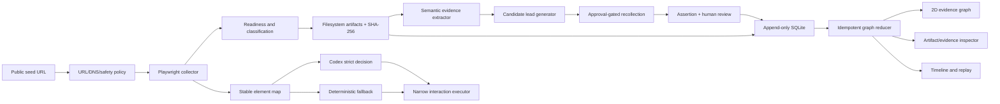

# BAB 5-7 - Pengembangan Solusi Perangkat Lunak

> **Status dokumen:** source Markdown proposal yang menggabungkan BAB 5, BAB 6, dan BAB 7.
> Urutannya adalah metodologi pengembangan, analisis kebutuhan/desain solusi, lalu implementasi.
> Nama produk, identitas tim, institusi, pembimbing, dan metadata lomba masih harus diisi serta
> diverifikasi oleh manusia.

Dokumen ini adalah satu sumber bab untuk JudolGraph / HAWK-EYE. Ia menjelaskan hubungan yang dapat
ditelusuri dari **kebutuhan -> desain -> implementasi -> pengujian -> bukti**. Status dan angka yang
berubah mengikuti snapshot verifikasi harus dibaca bersama `docs/STATUS.md` dan
`gemastik-2026/IMPLEMENTATION_STATUS.md`.

---

# BAB 5 - Metodologi Pengembangan Perangkat Lunak

## 5.1 Pendekatan pengembangan

JudolGraph / HAWK-EYE dikembangkan dengan pendekatan **iterative-incremental** yang berorientasi
pada bukti (*evidence-driven*). Pendekatan ini dipilih karena masalah yang diselesaikan bukan hanya
membuat crawler, tetapi juga memastikan bahwa setiap hasil dapat ditelusuri, dibatasi, diuji, dan
ditafsirkan secara hati-hati.

Tim tidak mengklaim menggunakan Scrum formal dengan peran, jadwal sprint, atau artefak organisasi
yang belum terdokumentasi. Istilah yang digunakan adalah *milestone* dan *iterasi teknis*: setiap
iterasi mempunyai tujuan, batas keselamatan, acceptance criteria, fixture atau data verifikasi,
keputusan desain, serta catatan keterbatasan.

Siklus dasar setiap iterasi adalah:

```text
Identifikasi masalah
        -> kebutuhan terukur
        -> desain dan keputusan batas
        -> implementasi terkecil yang dapat diuji
        -> pengujian fixture/regresi
        -> demo atau evaluasi opt-in
        -> review bukti dan keterbatasan
        -> iterasi perbaikan berikutnya
```

Perubahan pada collector, agen, graph, atau UI harus dapat dikaitkan dengan kode, test, artefak,
dan keputusan arsitektur yang relevan.

## 5.2 Prinsip proses

1. **Bukti sebelum kesimpulan.** Artefak capture dan observasi disimpan sebelum kandidat atau
   relasi dibuat.
2. **Deterministik sebagai jalur dasar.** Collector, extractor, candidate generator, comparison,
   fixture runtime, dan fallback agen menggunakan aturan yang dapat diulang.
3. **Batas eksplisit.** Batas URL, DNS, same-site crawl, halaman, waktu, ukuran HTML, tindakan,
   dan recollection ditulis sebagai konfigurasi serta diuji.
4. **Kegagalan harus dapat dijelaskan.** Restriction, challenge, timeout, HTML besar, kegagalan
   model, tindakan terblokir, dan review yang belum selesai dipersist sebagai status atau event.
5. **Live observation bukan test truth.** Situs publik hanya digunakan secara opt-in; fixture lokal
   dan manifest evaluasi menjadi dasar regression test.
6. **Keputusan manusia tetap diperlukan.** Kandidat adalah lead; assertion dimulai dari
   `needs_review` dan status diturunkan dari riwayat review append-only.

## 5.3 Tahapan dan iterasi aktual

| Iterasi | Fokus | Hasil yang ditargetkan | Bukti validasi |
|---|---|---|---|
| V0-V1 | Seed, safety, capture, extraction, graph dasar, console localhost | Jalur minimum dari URL publik ke artefak dan graph | Test collector, safety, extraction, graph, baseline tag |
| G0 | Governance dan evaluasi reproducible | Aturan permanen, fixture policy, manifest live opt-in, evaluator read-only | `docs/`, manifest evaluasi, verifier lokal |
| G1 | Capture-readiness diagnostics | Checkpoint pengukuran untuk shell yang terlambat render | Fixture diagnostik dan `hawkeye diagnose` |
| G2 | Workflow investigator | Narasi kasus, provenance, relasi, bahasa lead yang netral | UI/API test dan demo sanitized |
| G3 | Paket demonstrasi | Label fixture hash-backed, threat model, evaluator guide, storyboard | Verifier G3 dan laporan lokal |
| G4A | Capture adequacy | Checkpoint render, settle terbatas, screenshot, access/adequacy status | `tests/test_capture_adequacy.py` |
| G4B | Semantic evidence | Observasi bertipe dengan raw/normalized value dan provenance | `tests/test_semantic_evidence.py` |
| G5 | Controlled safe expansion | Sepuluh skenario interaksi, stable references, tool sempit, policy preflight | `tests/test_controlled_interaction.py` dan benchmark |
| G6 | Bounded Codex runtime | Capability probe, strict output, reference validation, retry, fallback | `tests/test_agent_runtime.py` dan capability JSON |
| G7 | Candidate recollection dan review | Lead, approval, Page B, assertion evidence-backed, SQLite append-only | Runtime/review tests dan walkthrough |
| G8 | Event-driven graph dan evaluasi | Event monotonic, reducer idempoten, replay, tiga mode benchmark | Runtime/reducer tests dan benchmark JSON |
| G9 | Paket GEMASTIK | Proposal, technical document, video script, matrix klaim, lisensi | Folder `gemastik-2026/` dan checklist |

Jika iterasi menemukan defect, perubahan dilakukan pada fixture atau reproducer lokal terlebih
dahulu. Observasi Chrome dan situs live hanya menjadi catatan perbandingan, bukan dasar perubahan
collector tanpa reproducer aman.

## 5.4 Alur kerja satu perubahan fitur

### 5.4.1 Perumusan masalah dan kebutuhan

Masalah ditulis sebagai perilaku yang dapat diamati, misalnya capture kosong pada checkpoint awal
atau tombol Contact yang menyimpan bukti publik tetapi belum muncul. Kebutuhan dipisahkan menjadi
perilaku yang harus ada, perilaku yang harus diblokir, artefak/provenance yang wajib disimpan,
status ketidakpastian, dan acceptance criteria yang dapat diuji tanpa internet.

### 5.4.2 Desain dan keputusan batas

Desain ditulis dalam ADR dan dokumen scope sebelum implementasi besar. Contohnya adalah pemisahan
`navigation_status`, `access_outcome`, `capture_adequacy`, dan `extraction_eligible`; larangan
candidate-domain crawl otomatis; serta keputusan bahwa animation queue bukan sumber kebenaran graph.

### 5.4.3 Implementasi incremental

Implementasi dimulai dari fungsi deterministik terkecil. Model data, storage, collector, policy,
runtime, reducer, dan UI dihubungkan setelah kontrak masing-masing dapat diuji. Agen Codex hanya
menerima context terstruktur dan mengembalikan `AgentDecision`; ia tidak menerima Playwright,
shell, database, atau filesystem handle.

### 5.4.4 Pengujian dan review

Setiap perubahan melewati test terdekat dengan failure mode, kemudian regression test yang lebih
luas. Untuk UI, API response, DOM accessibility, canvas, screenshot, dan console log diperiksa
sebagai bukti berbeda. Jika bukti tidak cukup, status tetap `pending`, `limited`, atau
`needs_review`.

## 5.5 Strategi pengujian dan validasi

| Lapisan | Tujuan | Contoh bukti |
|---|---|---|
| Unit | Fungsi lokal dan model | Normalisasi URL, extractor, classification, policy |
| Integrasi | Kontrak antar modul | Pipeline capture, loader integrity, workspace API, SQLite |
| Fixture interaction | Aksi aman dan terlarang | Sepuluh fixture terkontrol |
| Regression | Perilaku milestone lama | Frozen verifier dan manifest hash |
| Benchmark | Perbandingan tiga mode | `raw-results.json`, Markdown result, policy metrics |
| UI/manual | Jalur judge dapat digunakan | Localhost walkthrough, canvas, inspector, replay |
| Live qualitative | Robustness opt-in | Manifest URL dan catatan lingkungan; bukan CI truth |

Gate teknis adalah formatter, linter, type checker, test relevan/full suite, JavaScript syntax
check, `git diff --check`, dan satu demonstrasi lokal yang dapat diulang.

## 5.6 Evaluasi, risiko, dan definition of done

Evaluasi menjalankan fixture yang sama dalam mode **static**, **rule-based**, dan **agent-assisted**.
Mode terakhir menggunakan capability gate dan fallback deterministik saat Codex tidak tersedia atau
output tidak lolos validasi. Perbedaan mode dibaca sebagai coverage/task behavior pada fixture,
bukan sebagai ukuran kecerdasan model atau akurasi live-web.

Risiko utama adalah render terlambat, reference model tidak sah, kandidat dianggap fakta, animasi
menyimpang dari event, live site berubah, dan regresi milestone lama. Responsnya adalah checkpoint,
strict schema, exact-reference check, status pending/dashed, event-first reducer, fixture lokal,
dan full regression.

Increment siap masuk paket GEMASTIK jika kebutuhan dan batasnya terbaca, implementasi dapat
dijalankan, test atau report memverifikasi perilaku utama dan negative path, artefak memiliki
provenance, limitation tertulis, demo dapat diulang, dan klaim tidak melampaui bukti. Survei
pengguna, dampak nasional, sustainability finansial, nama tim, tanda tangan, orisinalitas, dan
review lisensi tetap menjadi pekerjaan manusia.

---

# BAB 6 - Analisis Kebutuhan dan Desain Solusi Perangkat Lunak

## 6.1 Analisis permasalahan dan stakeholder

Investigasi halaman publik sering berkembang dari satu URL menjadi rangkaian halaman, kontak,
redirect, asset, dan domain tujuan. Masalah utamanya adalah provenance terpisah, HTTP sukses yang
disalahartikan sebagai capture memadai, observasi yang disalahartikan sebagai ownership, tombol yang
memulai tindakan berisiko, dan graph animatif yang tidak memiliki sumber event.

Stakeholder utama adalah investigator/analis, evaluator/juri, dan maintainer/developer. Investigator
membaca screenshot, visible text, event, provenance, lead, dan review. Evaluator memerlukan demo
singkat dengan artefak nyata. Maintainer memerlukan fixture, test, manifest, ADR, dan limitation.
MVP bukan sistem penetapan pemilik, operator, kriminalitas, atau status legal.

## 6.2 Kebutuhan fungsional

| ID | Kebutuhan | Kriteria penerimaan |
|---|---|---|
| FR-01 | Menerima seed URL HTTP(S) publik | URL divalidasi, DNS diperiksa, private/loopback ditolak |
| FR-02 | Capture browser bounded | Page, depth, redirect, request, waktu, dan ukuran dibatasi |
| FR-03 | Menilai readiness | Checkpoint render, delta, visible text, dan visual metrics tersimpan |
| FR-04 | Menyimpan artefak provenance | HTML, screenshot, text, metadata, readiness, dan hash memiliki reference |
| FR-05 | Memisahkan access/adequacy/extraction/public status | Content dapat tetap `limited`; challenge tidak dianggap adequate |
| FR-06 | Mengekstrak observasi publik | Kontak, link, redirect, download, referral, tracking, claim, payment, offer, legal |
| FR-07 | Menampilkan interactive element map | Elemen memiliki stable reference dan snapshot context |
| FR-08 | Membatasi interaksi | Login, form, komunikasi, download, payment, unsafe/ambiguous diblokir |
| FR-09 | Menjalankan agen bounded | Hanya `AgentDecision` schema dan issued reference |
| FR-10 | Menyediakan fallback | Route/schema/reference/transport failure menghasilkan fallback dan failure record |
| FR-11 | Menemukan lead | Direct link, redirect, new tab, iframe, fixture index menjadi pending lead |
| FR-12 | Mencocokkan case lokal | Hostname exact yang sudah ada diproyeksikan sebagai collected destination |
| FR-13 | Recollection setelah approval | Kandidat unseen direcollect satu Page B dengan depth nol |
| FR-14 | Assertion dan review | Assertion `needs_review`, review berversi, riwayat append-only |
| FR-15 | Graph dari event | Event direduksi menjadi node, edge, timeline, dan causal link |
| FR-16 | Workspace investigator | Graph, minimap, search, screenshot inspector, timeline, review, export |
| FR-17 | Evaluasi reproducible | Benchmark tiga mode, raw JSON, Markdown, policy metrics |
| FR-18 | Limitation terlihat | Status provisional, blocked, limited, pending, needs review eksplisit |

## 6.3 Kebutuhan non-fungsional

| ID | Kebutuhan | Penerapan |
|---|---|---|
| NFR-01 | Reproducibility | Fixture `.invalid`, fallback deterministic, manifest, event sequence |
| NFR-02 | Auditability | Stable ID, SHA-256, source reference, timestamp, causation ID, review history |
| NFR-03 | Safety | Public-only URL, same-site scope, server preflight, no form/download/communication |
| NFR-04 | Bounded execution | Budget page/depth/request/redirect/HTML/screenshot/action/approval |
| NFR-05 | Integrity | Loader memverifikasi manifest, size, type, hash, evidence, candidate reference |
| NFR-06 | Privacy/locality | Bind `127.0.0.1`, Host allow-list, CSP, no CORS, no remote asset |
| NFR-07 | Failure transparency | Failure event/status tersimpan; block tidak diubah menjadi success |
| NFR-08 | Accessibility | Inspector/tabel, label status, reduced-motion, DOM path tanpa canvas |
| NFR-09 | Maintainability | Modul collector, extraction, interaction, agent, runtime, store, reducer, UI, evaluator |
| NFR-10 | Human control | Approval dan assertion review aksi eksplisit; no ownership probability |

## 6.4 Alur aplikasi



## 6.5 Arsitektur dan trust boundary



Trust boundary-nya adalah public web sebagai untrusted content, collector sebagai policy boundary,
agent sebagai strict serialized context tanpa handle, review sebagai satu-satunya promosi ke
`verified`, dan UI localhost sebagai renderer artifact inert dengan Host/origin/path validation.

## 6.6 Desain data, komponen, dan UI/UX

Komponen utama adalah URL/safety policy, browser collector, capture classifier, semantic extractor,
stable element map, interaction policy/executor, agent adapter, candidate generator,
recollection/review, event store, graph reducer, dan investigator UI.

`CaptureReadiness` menyimpan checkpoint, delta, adequacy, limitation, canonical checkpoint,
response metadata, HTML hash/omission, screenshot state, blocked resources, popup/download count,
collector/policy version, dan waktu. `SemanticObservation` menyimpan raw/normalized value, source
page/artifact, selector/context, screenshot/crop, confidence, extraction method, evidence strength,
attributes, serta limitation.

`CandidateLead` menyimpan URL, discovery method, source observation IDs, collection mode, approval
status, dan waktu. `CandidateAssertion` menyimpan relation type, subject/object, supporting
observations, source artifacts, limitations, dan initial `needs_review`. `InvestigationEvent`
memiliki sequence monotonic, case/run ID, kind, occurred time, causation/correlation ID, schema
version, dan payload.

Workspace dibagi menjadi landing/case view, graph investigation view, dan summary/export view.
Canvas bukan satu-satunya cara membaca data: node/edge penting juga tersedia pada tabel/inspector.
Warna dilengkapi text status, appearance, provenance, dan reduced-motion path.

## 6.7 Keamanan dan batas desain

Hanya HTTP(S) public yang lolos URL/DNS validation. Redirect/resource diperiksa kembali. Sistem
tidak melakukan authentication, CAPTCHA bypass, geo/rate-limit bypass, form, message, payment,
betting, download, atau external application scheme.

Case loader memverifikasi manifest, path, hash, byte/type limit, evidence reference, dan observation
reference. HTML disajikan sebagai attachment inert. Kandidat tidak pernah diklaim sebagai owner,
operator, network, kriminal, atau legal conclusion; similarity hanyalah similarity evidence.

MVP tidak mencakup public deployment, multi-user authentication, distributed queue, private data,
automatic crawl generated candidates, atau universal live-web safety guarantee.

---

# BAB 7 - Implementasi Perangkat Lunak

## 7.1 Lingkup dan struktur modul

Implementasi memiliki dua jalur: **evidence core** untuk capture, artifact, observation, dan graph
deterministik; serta **investigator workspace** untuk fixture interaction, event graph, screenshot,
timeline, approval, dan human review lokal. Paket Python `hawkeye` dipakai oleh CLI dan FastAPI;
frontend adalah vanilla JavaScript tanpa remote runtime dependency.

| Area | Modul utama | Peran |
|---|---|---|
| CLI | `hawkeye/cli.py`, `hawkeye/__main__.py` | `investigate`, `serve`, `benchmark`, `codex-probe`, `diagnose`, `evaluate`, `demo` |
| Model | `hawkeye/models.py` | Capture, readiness, crawl, evidence, observation, candidate, graph |
| Safety/crawl | `hawkeye/collector/safety.py`, `hawkeye/crawl.py`, `hawkeye/pipeline.py` | URL/DNS, same-host BFS, budget, redirect, failure |
| Browser | `hawkeye/collector/playwright_collector.py` | Render, checkpoint, screenshot, response, blocked request |
| Extraction | `hawkeye/extraction/`, `hawkeye/semantic_evidence.py` | Entity dan semantic observation provenance-first |
| Interaction | `hawkeye/interaction/` | Stable reference, fixtures, preflight, executor |
| Agent | `hawkeye/agent/` | Capability probe, strict JSON, validation, retry, fallback |
| Investigation | `hawkeye/investigation/` | Event, lead, assertion, review, runtime, reducer |
| Storage | `hawkeye/storage/`, `hawkeye/investigation/store.py` | Artifact file, manifest/hash, SQLite append-only |
| UI | `hawkeye/review_app/` | API, workspace, canvas, minimap, inspector, timeline |
| Evaluation | `hawkeye/evaluation/`, `hawkeye/benchmark.py` | Manifest verifier, benchmark, policy metrics, report |

## 7.2 Capture dan semantic evidence

`SafetyPolicy` memvalidasi URL HTTP(S), hostname IDN, private/loopback address, credentials, dan
redirect. `pipeline.investigate` menjalankan same-host BFS maksimal 5 halaman pada depth 1, redirect
5 per halaman, timeout halaman 30 detik, timeout case 120 detik, 200 request, response 10 MB, dan
HTML persistence 5 MB. Link eksternal dicatat, bukan otomatis diikuti.

`BrowserCollector` menyimpan checkpoint 0, 500, 1500, dan 3000 ms, dengan settle extension 5000
dan 8000 ms bila masih berubah. Checkpoint mencatat ready state, HTML/visible text, element/link/
button/image count, document dimensions, screenshot metrics, SHA-256, ukuran, dan dimensi. Delta
menentukan perubahan material; classifier memisahkan navigation, access, adequacy, extraction
eligibility, dan public-facing status.

Artifact dapat berupa HTML, visible text, response/redirect metadata, canonical viewport
screenshot, initial screenshot, dan bounded full-page screenshot. Full-page dibatasi 12.000 px.
Omission karena HTML besar atau full-page failure ditulis sebagai limitation. Case loader memeriksa
stable evidence ID, media type, source page, timestamp, size, dan SHA-256.

`extract_semantic_observations` memakai BeautifulSoup untuk 15 tipe observasi:

```text
claimed_brand_identity
public_telegram_alias
public_telegram_contact
public_whatsapp_link
public_phone_number
public_email_address
public_outgoing_link
public_redirect_target
public_download_destination
public_payment_method
public_payment_provider
public_offer_claim
public_legal_or_license_claim
public_referral_code
public_tracking_identifier
```

Raw value tidak dibuang ketika normalized value dibuat. Selector/crop adalah best-effort jika
snapshot viewport stabil. Implementasi ini tidak mengklaim OCR universal untuk image-only content.

## 7.3 Controlled interaction dan bounded Codex

Sepuluh fixture interaksi didefinisikan pada `evaluation/fixtures/controlled-interactions-v1.json`
dengan seed `.invalid`, initial observations, stable elements, expected result, dan unsafe control
IDs. `StableElementReference` mengikat reference ke snapshot ID, DOM path, role, label, href/action,
dan fingerprint. `InteractionBudget` membatasi iterasi, interaksi, halaman, depth, redirect,
search, candidate page, dan runtime.

Policy memeriksa tag, role, accessible name, href/action, form, download, new-tab, declared
behavior, destination scheme, dan keyword risk. Login/register, submit form, komunikasi,
payment/betting, download, unsafe scheme, external application, dan ambiguous action diblokir
sebelum eksekusi. Block dipersist dengan `executed=false`. Jalur aman hanya state inspection,
public HTTP(S) link in-scope, redirect-chain, capture, atau fixture reveal.

`CodexLbClient` hanya memakai endpoint loopback berikut:

```text
http://127.0.0.1:2455/backend-api/codex
http://127.0.0.1:2455/v1/responses
```

Client mengirim context terstruktur dan strict JSON schema dengan timeout maksimal 30 detik, tanpa
browser, shell, database, filesystem, atau cookie handle. `_validate_context_decision` mencocokkan
reference model dengan reference server-issued pada snapshot yang sama.

`CodexInvestigator` mencoba paling banyak dua kali. Transport/schema/reference failure disimpan
sebagai `AgentFailure`; kemudian `DeterministicInvestigator` memilih satu public action yang lolos
policy atau `stop`. Kedua jalur memakai schema yang sama. Capability probe menentukan apakah route
dan strict output siap; service unavailable tidak diubah menjadi success palsu.

## 7.4 Candidate, recollection, assertion, dan SQLite review

Public link, redirect, iframe, new-tab, dan fixture index diproses menjadi `CandidateLead` yang
menyimpan URL, discovery method, source observations, collection mode, status, dan waktu. Hostname
yang sudah ada pada corpus lokal dapat diproyeksikan sebagai collected destination tanpa collection
ulang. Lead unseen tetap pending sampai approval.

Approval mengizinkan recollection satu halaman Page B dengan depth nol dan budget terbatas. Hasilnya
menjadi `CandidateAssertion` dengan relation type, subject/object, supporting observations, source
artifacts, dan limitations. Assertion dimulai `needs_review`; reviewer menambahkan `verified`,
`rejected`, `needs_more_evidence`, `duplicate`, atau `uncertain` beserta alasan.

`InvestigationStore` memakai tabel `events`, `candidate_leads`, `assertions`, dan `reviews`.
Trigger database menolak UPDATE/DELETE; review version meningkat append-only. Reviewer pada MVP
adalah label lokal, bukan authenticated identity.

## 7.5 Event-driven graph dan workspace

Event menyimpan event ID, sequence monotonic, case/run ID, kind, timestamp, causation/correlation
ID, schema version, dan payload. `reduce_events` membangun `ProgressiveGraphState` secara
idempotent. Node memproyeksikan seed/collected page, claimed brand, public contact/claim, external
destination, redirect, dan candidate domain. Edge appearance bermakna:

| Appearance | Makna |
|---|---|
| `solid` | Relasi observasi yang didukung event/artifact |
| `dashed` | Candidate/assertion provisional |
| `solid_emphasized` | Assertion mendapat review outcome yang sesuai |
| `hidden` | Relasi ditolak atau tidak boleh tampil sebagai graph fact |

Canvas, minimap, pan/zoom/drag, hit-test, search/focus, inspector, screenshot carousel, timeline,
replay, dan reduced-motion berada di `hawkeye/review_app/static/`. Animation queue hanya proyeksi
visual; pause, speed, replay, refresh, dan reduced-motion tidak mengubah event truth. Tabel dan
inspector tetap menjadi jalur pembacaan evidence tanpa canvas.

## 7.6 API dan demo lokal

Server dibuat oleh `hawkeye.review_app.create_app` dan dijalankan dengan `python -m hawkeye serve`.
Dengan `--workspace`, endpoint MVP adalah:

```text
GET  /api/mvp/scenarios
GET  /api/mvp/capabilities
GET  /api/mvp/runs
POST /api/mvp/runs
GET  /api/mvp/runs/{workspace_id}
POST /api/mvp/runs/{workspace_id}/reviews
POST /api/mvp/runs/{workspace_id}/approve
GET  /api/mvp/runs/{workspace_id}/artifacts/{artifact_name}
```

Jalur offline yang dapat diulang:

```powershell
python -m hawkeye benchmark --output verification-output/benchmark
python -m hawkeye serve --cases cases --workspace verification-output/mvp-workspace --port 8766
```

Evaluator dapat memilih scenario, melihat graph/timeline, membuka screenshot/JSON evidence, mencoba
review assertion, dan mengulang run. Live URL hanya evaluasi opt-in dengan output di direktori
ignored.

## 7.7 Verifikasi dan keterbatasan implementasi

Gate implementasi meliputi Ruff format, Ruff lint, strict mypy, unit/integration tests, JavaScript
syntax check, manifest/hash integrity, stable reference, append-only trigger, tiga-mode benchmark,
browser/local walkthrough, dan `git diff --check`. Snapshot angka dibaca dari
`IMPLEMENTATION_STATUS.md` dan `docs/STATUS.md`; angka live tidak menjadi klaim akurasi umum.

Keterbatasan saat ini adalah ketergantungan Codex pada capability probe/loopback, semantic extraction
berbasis DOM/visible text tanpa OCR universal, browser dan executor yang bounded serta same-site,
candidate/similarity yang bukan ownership probability, reviewer identity lokal, belum adanya public
deployment/authentication/multi-user authorization, dan perubahan live web menurut waktu/lokasi/
session. Fixture `.invalid` tetap menjadi regression truth.

## 7.8 Rujukan repositori

- `docs/GOAL.md`, `docs/ROADMAP.md`, `docs/DECISIONS.md`, `docs/STATUS.md`, `docs/EVALUATION.md`.
- `hawkeye/pipeline.py`, `hawkeye/collector/`, `hawkeye/semantic_evidence.py`.
- `hawkeye/interaction/`, `hawkeye/agent/`, `hawkeye/investigation/`.
- `hawkeye/review_app/`, `evaluation/fixtures/`, `evaluation/benchmarks/`, dan `tests/`.
- `gemastik-2026/IMPLEMENTATION_STATUS.md` dan `gemastik-2026/README.md`.
