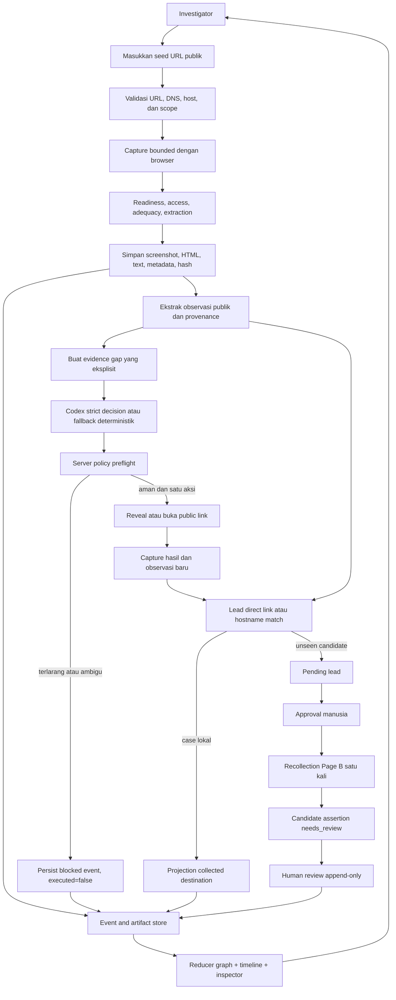

# BAB 6 - Analisis Kebutuhan dan Desain Solusi Perangkat Lunak

> **Status dokumen:** source Markdown proposal. Bab ini menjelaskan kebutuhan dan blueprint
> solusi; realisasi kode diringkas pada BAB 7.

## 6.1 Analisis permasalahan

Investigasi halaman web publik sering dimulai dari satu URL, kemudian berkembang menjadi rangkaian
halaman, kontak publik, redirect, asset, dan domain tujuan. Dalam alur manual, beberapa masalah
muncul bersamaan:

1. screenshot, HTML, teks, dan waktu pengambilan mudah terpisah dari URL sumber;
2. respons berhasil tidak selalu berarti halaman yang tersimpan sudah cukup untuk dibaca;
3. teks atau tautan yang sama dapat menjadi observasi tanpa membuktikan kepemilikan atau operator
   yang sama;
4. tombol yang terlihat informatif dapat membuka login, mengirim form, memulai download, atau
   membuka aplikasi eksternal;
5. candidate relationship sering ditampilkan sebagai garis pasti meskipun belum direview manusia;
6. graph yang dianimasikan dapat terlihat meyakinkan walaupun tidak memiliki event dan provenance
   yang dapat diperiksa.

JudolGraph dirancang untuk memisahkan lapisan-lapisan tersebut. Unit yang disimpan bukan hanya URL,
melainkan rangkaian berikut:

```text
Artifact -> Observation -> Entity or destination -> Candidate assertion -> Human review
```

Pemisahan ini memungkinkan sistem menunjukkan apa yang diamati, dari artefak mana, kapan diambil,
aturan apa yang menghasilkan observasi, serta bagian mana yang masih memerlukan keputusan manusia.

## 6.2 Pengguna dan stakeholder

### 6.2.1 Investigator atau analis

Memasukkan seed URL publik, membaca screenshot dan visible text, menelusuri event/timeline, membuka
provenance, dan memutuskan apakah sebuah lead layak direview atau direcollect setelah approval.

### 6.2.2 Evaluator atau juri

Memerlukan demo yang dapat dijalankan, alur yang singkat, indikator status yang jelas, artefak yang
nyata, serta penjelasan mengapa sebuah edge solid, dashed, emphasized, atau hidden.

### 6.2.3 Maintainer atau developer

Memerlukan fixture deterministik, test, manifest, keputusan arsitektur, status limitation, dan
storage yang dapat diinspeksi tanpa bergantung pada sesi browser sebelumnya.

### 6.2.4 Batas stakeholder

MVP ini bukan sistem penetapan pemilik, operator, kriminalitas, atau status legal. Istilah
`candidate`, `pending`, `needs_review`, dan `evidence similarity` adalah bagian dari desain
governance, bukan sekadar label UI.

## 6.3 Kebutuhan fungsional

| ID | Kebutuhan fungsional | Kriteria penerimaan |
|---|---|---|
| FR-01 | Menerima seed URL HTTP(S) publik | URL divalidasi, DNS diperiksa, destination privat/loopback produksi ditolak |
| FR-02 | Menjalankan capture browser yang bounded | Capture menggunakan budget halaman, depth, redirect, request, waktu, dan ukuran yang terdokumentasi |
| FR-03 | Menilai kesiapan capture | Checkpoint render, delta, visible text, dan metrik visual disimpan sebagai readiness evidence |
| FR-04 | Menyimpan artefak dengan provenance | HTML, screenshot, visible text, metadata, readiness, dan hash memiliki stable reference |
| FR-05 | Memisahkan access, adequacy, extraction, dan public status | Satu halaman dapat `content` tetapi `limited`, atau `access_challenge` tanpa dianggap adequate |
| FR-06 | Mengekstrak observasi publik | Telegram, WhatsApp, telepon, email, outgoing link, redirect, download, referral, tracking, claim, payment, offer, dan legal claim memiliki tipe serta sumber |
| FR-07 | Menampilkan interactive element map | Elemen memiliki stable reference dan snapshot context yang dapat diverifikasi |
| FR-08 | Membatasi interaksi | Login, register, form, komunikasi, download, payment, unsafe destination, dan ambiguous action diblokir sebelum eksekusi |
| FR-09 | Menggunakan agen secara bounded | Codex hanya memilih `AgentDecision` schema; reference harus sama dengan reference server-issued |
| FR-10 | Menyediakan fallback deterministik | Jika route, schema, reference, atau transport gagal, fallback menghasilkan bentuk keputusan yang sama dan failure record |
| FR-11 | Menemukan lead dari evidence | Direct link, redirect, new tab, iframe, dan fixture index dapat menjadi pending lead tanpa auto-crawl kandidat baru |
| FR-12 | Mencocokkan case lokal | Hostname exact yang sudah ada dapat diproyeksikan sebagai collected destination tanpa collection ulang |
| FR-13 | Mengumpulkan kandidat setelah approval | Candidate yang belum ada di corpus hanya direcollect setelah approval eksplisit dan budget satu halaman/depth nol |
| FR-14 | Menyimpan assertion dan review | Assertion dimulai `needs_review`; review memiliki versi, alasan, reviewer label, dan riwayat append-only |
| FR-15 | Membangun graph dari event | Event direduksi menjadi node/edge/timeline/causal link; animation tidak membuat fakta baru |
| FR-16 | Menyediakan workspace investigator | Graph, minimap, search/focus, screenshot-first inspector, timeline/replay, candidate, assertion, review, dan export dapat diakses lokal |
| FR-17 | Menyediakan evaluasi reproducible | Benchmark tiga mode, raw JSON, Markdown result, dan policy metrics dapat dibuat dari fixture |
| FR-18 | Menjelaskan limitation | UI dan export menampilkan status provisional, blocked, limited, pending, dan needs review secara eksplisit |

## 6.4 Kebutuhan non-fungsional

| ID | Kebutuhan | Desain penerapan |
|---|---|---|
| NFR-01 | Reproducibility | Fixture `.invalid`, deterministic fallback, manifest, event sequence, dan command yang terdokumentasi |
| NFR-02 | Auditability | Stable IDs, SHA-256, source artifact reference, timestamp, causation ID, dan review history |
| NFR-03 | Safety | Public-only URL policy, same-site scope, server-side preflight, no login/form/download/communication |
| NFR-04 | Bounded execution | Page/depth/request/redirect/HTML/screenshot/action/approval budgets |
| NFR-05 | Integrity | Case loader memverifikasi manifest, ukuran, type, hash, evidence reference, dan candidate reference |
| NFR-06 | Privacy and locality | Console bind ke `127.0.0.1`, Host header allow-list, strict CSP, no CORS, no remote asset |
| NFR-07 | Failure transparency | Failure event/status tersimpan; fallback dan blocked action tidak diubah menjadi success |
| NFR-08 | Accessibility | Tabel relasi, inspector, label status, reduced-motion, dan DOM path tetap dapat dibaca tanpa canvas |
| NFR-09 | Maintainability | Modul dipisahkan menurut collector, extraction, interaction, agent, runtime, store, reducer, UI, dan evaluator |
| NFR-10 | Human control | Candidate approval dan assertion review merupakan aksi eksplisit; tidak ada ownership probability otomatis |

## 6.5 Alur aplikasi dan business process

Alur penggunaan berbeda dari alur pengembangan pada BAB 5. Berikut adalah workflow yang dialami
investigator:



Proses berhenti jika destination tidak aman, capture tidak dapat dilakukan, evidence gap sudah
tertutup, budget habis, atau kandidat menunggu approval. Setiap stop reason diperlakukan sebagai
hasil yang dapat diaudit.

## 6.6 Arsitektur solusi

```mermaid
flowchart LR
    subgraph Input["Input dan batas"]
        Seed["Public seed URL"]
        Policy["URL/DNS/safety policy"]
    end
    subgraph Capture["Deterministic evidence core"]
        Collector["Playwright collector"]
        Ready["Readiness and capture classification"]
        Artifacts["Filesystem artifacts + SHA-256"]
        Semantic["Semantic evidence extractor"]
    end
    subgraph Explore["Bounded exploration"]
        Elements["Stable element map"]
        Agent["Codex strict decision"]
        Fallback["Deterministic fallback"]
        Executor["Narrow interaction executor"]
    end
    subgraph Relations["Reviewable relationships"]
        Leads["Candidate lead generator"]
        Recollect["Approval-gated recollection"]
        Assertion["Assertion + human review"]
    end
    subgraph Truth["Persistent truth"]
        SQLite["Append-only SQLite events"]
        Reducer["Idempotent graph reducer"]
    end
    subgraph UI["Investigator workspace"]
        Canvas["2D evidence graph"]
        Inspector["Artifact/evidence inspector"]
        Timeline["Timeline and replay"]
    end

    Seed --> Policy --> Collector
    Collector --> Ready --> Artifacts
    Artifacts --> Semantic
    Collector --> Elements
    Elements --> Agent
    Elements --> Fallback
    Agent --> Executor
    Fallback --> Executor
    Executor --> Artifacts
    Semantic --> Leads
    Leads -->|"known case"| SQLite
    Leads -->|"unseen lead"| Recollect
    Recollect --> Assertion --> SQLite
    Artifacts --> SQLite
    SQLite --> Reducer
    Reducer --> Canvas
    Reducer --> Inspector
    Reducer --> Timeline
```



### 6.6.1 Trust boundaries

1. **Public web boundary:** target pages are untrusted content. Instructions found on a page never
   become instructions to the system.
2. **Collector boundary:** browser requests pass URL/DNS and resource policy; the collector is
   non-interactive except for the separately bounded reveal path.
3. **Agent boundary:** the model sees a bounded serialized context and can return only a strict
   decision object. It cannot call browser, shell, database, or filesystem APIs directly.
4. **Review boundary:** candidate and assertion state are not promoted by similarity or model
   output; human review is the only status transition to `verified`.
5. **UI boundary:** the localhost console renders verified local artifacts and rejects unsafe Host,
   origin, path, and artifact references.

## 6.7 Desain komponen

| Komponen | Tanggung jawab desain | Input | Output |
|---|---|---|---|
| URL and safety policy | Normalisasi URL, DNS safety, allowed host, redirect/resource check | Raw URL, request | Validated URL atau blocked reason |
| Browser collector | Render page, checkpoint, bounded crawl, screenshot, response observation | Validated URL | Page record, evidence artifacts, readiness |
| Capture classifier | Pisahkan access, adequacy, extraction eligibility, public status | Checkpoint and response metrics | Classification + limitation |
| Semantic extractor | Ambil observasi publik dari HTML, anchors, redirects, visible text | Eligible/provisional capture | Typed observations + provenance |
| Stable element map | Representasi bounded elemen yang dapat direferensikan | Browser DOM | Snapshot-bound references |
| Interaction policy/executor | Preflight dan eksekusi hanya aksi read-only yang aman | Reference + policy context | Blocked/completed event dan resulting capture |
| Agent adapter | Capability probe, strict output, exact reference, retry | Visible context | Agent decision atau failure/fallback |
| Candidate generator | Normalisasi direct link, redirect, iframe, new tab, corpus match | Observations and cases | Pending lead or collected destination |
| Recollection/review | Approval, Page B capture, assertion, review version | Lead and reviewer input | Evidence-backed assertion state |
| Event store | Persist event, lead, assertion, review append-only | Domain events | SQLite history |
| Graph reducer | Derive nodes, edges, causal links, timeline, animation queue | Event history | Progressive graph state |
| Investigator UI | Project graph truth, screenshot, artifacts, timeline, review | API projection | Readable workspace and exports |

## 6.8 Desain data dan evidence model

### 6.8.1 Capture and artifact

Satu capture memiliki case, page, frontier, response metadata, readiness, classification, dan
artifact references. Artifact yang dirancang untuk provenance antara lain:

- canonical HTML bila masih dalam persistence limit;
- screenshot viewport canonical;
- screenshot awal saat berubah;
- bounded full-page screenshot;
- browser-visible text;
- response metadata dan redirect chain;
- capture readiness checkpoints/deltas;
- semantic evidence crop jika bounding box stabil.

Setiap artifact memiliki `id`, path relatif, type, source URL, timestamp, ukuran/dimensi bila
relevan, dan SHA-256. HTML yang terlalu besar tidak dipaksa masuk extractor; omission menjadi
limitation yang terlihat.

### 6.8.2 Observation, entity, lead, assertion

`SemanticObservation` menyimpan `observation_type`, raw/normalized value, source page, source
artifact, selector/context, screenshot/crop, confidence, extraction method, evidence strength,
attributes, dan limitation. Observation bukan assertion.

`CandidateLead` menyimpan URL, discovery method, source observation IDs, collection mode, status
approval, dan waktu. `CandidateAssertion` menyimpan tipe relasi, subject/object, supporting
observations, source artifacts, limitation, dan initial status `needs_review`.

### 6.8.3 Event dan graph

`InvestigationEvent` menyimpan sequence monotonic, case/run ID, kind, occurred time, causation ID,
correlation ID, schema version, dan payload. Reducer menghasilkan:

- graph node dengan status `observed`, `lead`, `collected`, `verified`, atau `rejected`;
- graph edge dengan appearance `solid`, `dashed`, `solid_emphasized`, atau `hidden`;
- timeline dan causal links;
- animation queue yang hanya merupakan proyeksi visual.

Dengan desain ini, refresh, replay, reduced motion, atau perubahan posisi canvas tidak mengubah
event truth.

## 6.9 Desain keamanan, governance, dan privasi

### 6.9.1 Collection safety

- Hanya HTTP(S) public destination yang lolos URL dan DNS validation.
- Same-site crawl memiliki depth dan page budget.
- Redirect/resource request divalidasi kembali.
- Authentication, CAPTCHA, geo restriction bypass, rate-limit bypass, form, message, payment,
  betting, download, dan external application scheme tidak dilakukan.

### 6.9.2 Interaction safety

Preflight memeriksa tag, role, label, href, action, form, download, new-tab, destination scheme,
keyword, snapshot reference, dan action budget. Failure atau block tetap dicatat dengan
`executed=false` bila tidak dijalankan.

### 6.9.3 Evidence integrity

Case loader memverifikasi manifest, file path, hash, byte/type limit, evidence reference, dan
observation reference sebelum delivery. HTML disajikan sebagai attachment inert, bukan HTML yang
boleh mengeksekusi script di console.

### 6.9.4 Review and interpretation

Kandidat tidak diklaim sebagai owner, operator, mirror, network, kriminal, atau legal conclusion.
Similarity adalah similarity evidence. Edge dashed atau status `needs_review` tidak boleh ditulis
sebagai fakta final.

## 6.10 Desain antarmuka dan user experience

Workspace dibagi menjadi tiga view agar fungsi tidak bercampur.

1. **Case/landing view:** seed URL, mode capture, daftar case lokal, dan batas scope.
2. **Graph investigation view:** graph 2D, minimap, filter/search, evidence inspector, screenshot
   first, action/timeline status, candidate, assertion, dan review.
3. **Summary/export view:** ringkasan case, chronology, artifact manifest, claim limitation, dan
   export Markdown/JSON/ZIP.

Canvas tidak menjadi satu-satunya cara membaca data. Setiap node/edge penting memiliki tabel atau
inspector dengan label, status, provenance, dan event source. Warna bukan satu-satunya indikator;
appearance, text status, dan reduced-motion path juga tersedia.

## 6.11 Traceability kebutuhan ke desain

| Kebutuhan | Komponen desain utama | Bukti verifikasi |
|---|---|---|
| Capture jujur | Collector + readiness + classification | Capture adequacy fixtures |
| Provenance | Artifact store + hashes + loader | Integrity and semantic tests |
| Interaksi aman | Stable map + policy + narrow executor | Ten controlled scenarios |
| Agent bounded | Capability gate + schema + fallback | Agent runtime tests and probe |
| Candidate netral | Lead + approval + assertion + review | Investigation runtime/review tests |
| Graph dapat diaudit | Event store + reducer + timeline | Replay/idempotency tests |
| Demo reproducible | Fixture index + benchmark + local console | Benchmark and UI API tests |

## 6.12 Batas desain

Desain ini sengaja tidak mencakup public deployment, multi-user authentication, distributed queue,
private data collection, automatic crawl terhadap generated candidates, atau universal live-web
safety guarantee. Penambahan tersebut memerlukan milestone threat model, authorization, dan
evaluation baru.

## 6.13 Rujukan bukti repositori

- `hawkeye/collector/` - URL safety dan browser collector.
- `hawkeye/models.py` - capture, semantic, artifact, entity, dan graph baseline model.
- `hawkeye/interaction/` - stable references dan policy.
- `hawkeye/agent/` - capability probe, strict decision, dan fallback.
- `hawkeye/investigation/` - runtime, event store, assertion/review, dan reducer.
- `hawkeye/review_app/` - localhost API, workspace, canvas, inspector, dan timeline.
- `docs/DECISIONS.md` - ADR tentang scope dan trust boundary.
