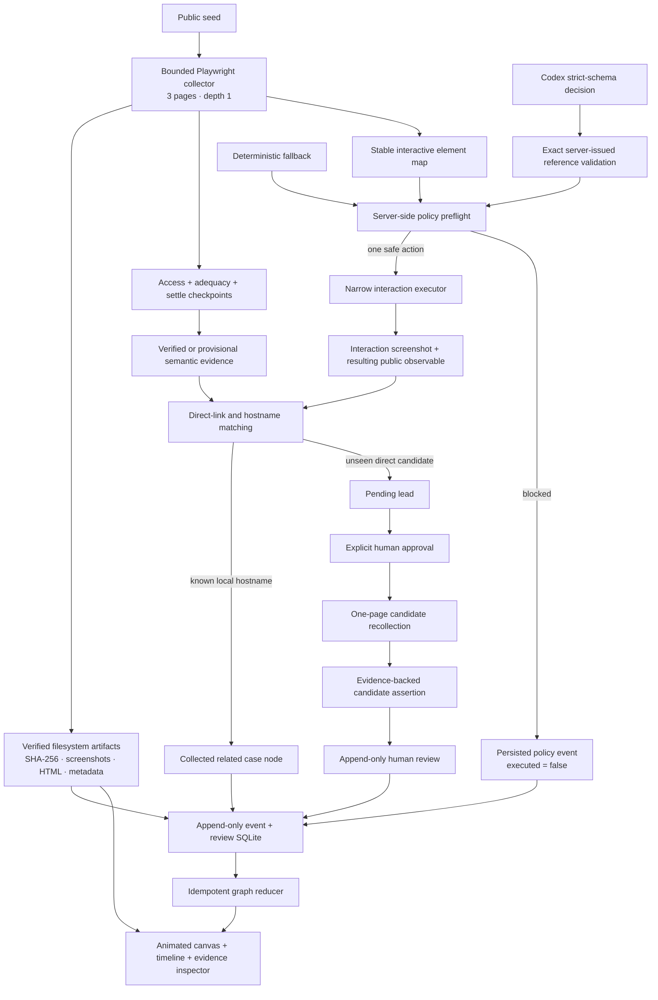

# [NAMA PRODUK FINAL]

> Project HAWK-EYE — internal codename. Preliminary Markdown source; not a submission-ready PDF.
> TODO — requires human confirmation: final product name, team identity, category, institution,
> advisor, signatures, publication history, and official template metadata.

## 1. Judul/Nama Perangkat Lunak

**[NAMA PRODUK FINAL]** adalah ruang kerja investigasi bukti web publik yang menjaga hubungan jelas
antara tangkapan halaman, observasi semantik, kandidat yang belum terverifikasi, pernyataan relasi,
keputusan manusia, dan graf bukti progresif. Nama internal repositori tetap JudolGraph / HAWK-EYE;
nama tersebut tidak diajukan sebagai nama publik final.

Produk berjalan secara lokal pada `127.0.0.1`. MVP awal menggunakan kolektor Python Playwright,
penyimpanan artefak berbasis berkas, indeks SQLite append-only, konsol web lokal, agen Codex yang
dibatasi melalui `codex-lb` ketika kemampuan yang diperlukan dapat diverifikasi, dan fallback
deterministik ketika endpoint atau kemampuannya tidak tersedia.

Kalimat produk yang diusulkan:

> Dari halaman publik ke relasi yang dapat ditinjau—setiap langkah memiliki bukti, batas, dan jejak
> peristiwa.

## 2. Latar Belakang Ide Perangkat Lunak

Investigasi web publik sering dimulai dari satu URL dan pertanyaan sederhana: apa yang benar-benar
terlihat saat halaman dikunjungi, petunjuk publik apa yang tersedia, dan apakah petunjuk tersebut
layak mengarahkan peninjau ke halaman lain? Alur manual mudah kehilangan asal-usul bukti. Screenshot
terpisah dari URL, teks hasil salin terpisah dari waktu pengambilan, dan dugaan hubungan dapat
ditampilkan seolah-olah merupakan fakta.

Terdapat empat masalah teknis yang ingin diatasi MVP ini.

Pertama, keberhasilan navigasi tidak sama dengan kecukupan tangkapan. Halaman dapat berhasil memuat
tetapi masih kosong pada milidetik awal, terus berubah hingga batas waktu, berisi DOM tersembunyi,
menampilkan tantangan akses, atau memiliki HTML terlalu besar untuk ekstraksi langsung. Karena itu,
produk memisahkan `navigation_status`, `access_outcome`, `capture_adequacy`, dan
`extraction_eligible`.

Kedua, observasi bukan kesimpulan. Alias Telegram publik, tautan WhatsApp, kode referral, tujuan
redirect, atau klaim merek dapat diamati. Namun observasi tersebut tidak dengan sendirinya
membuktikan pemilik, operator, jaringan, atau status hukum. Model data memisahkan artefak,
observasi, entitas, kandidat assertion, dan human review.

Ketiga, interaksi otomatis memiliki risiko. Tombol yang terlihat ramah dapat mengirim formulir,
membuka aplikasi eksternal, memulai download, mengarah ke login, atau memicu transaksi. Agen tidak
diberi Playwright mentah. Setiap elemen menggunakan referensi stabil yang terikat snapshot dan
setiap tindakan melewati kebijakan server sebelum eksekusi.

Keempat, graf yang terlihat progresif dapat menipu jika animasi menjadi sumber kebenaran. Produk
menyimpan event terlebih dahulu, mereduksi event menjadi graf yang idempoten, lalu menjalankan
animasi terpisah. Dengan demikian, refresh, replay, atau reduced-motion tidak mengubah fakta yang
ditampilkan.

Urgensi masalah dan data dampak eksternal belum dicantumkan sebagai angka karena belum diverifikasi.
TODO — requires external source: sumber resmi dan akademik Indonesia tentang skala investigasi
konten publik, kebutuhan provenance digital, dan dampak operasional yang relevan dengan tema lomba.
Tidak ada wawancara, peserta usability, atau statistik pengguna yang diklaim pada proposal ini.

## 3. Tujuan dan Manfaat Dikembangkannya Perangkat Lunak

Tujuan utama adalah menyediakan alur lokal yang dapat direproduksi:

```text
Public seed
→ bounded same-site capture (up to 3 pages, depth 1)
→ verified or explicitly provisional semantic evidence
→ explicit evidence gap
→ one Codex-selected or deterministic safe interaction
→ public observable
→ direct candidate discovery or local-case hostname match
→ explicit approval before an unseen candidate is collected
→ evidence-backed candidate relation
→ human review
→ progressive evidence graph
```

Manfaat bagi peneliti atau evaluator:

1. **Keterlacakan.** Artefak tersimpan dengan SHA-256; observasi merujuk artefak, screenshot, dan
   konteksnya; assertion merujuk observasi dari kedua halaman.
2. **Bahasa ketidakpastian yang jujur.** Kandidat adalah lead. Status `verified` hanya berarti bukti
   yang dipilih mendukung relasi yang dinyatakan.
3. **Keselamatan yang dapat diuji.** Kebijakan klik diuji terhadap 10 skenario sintetis, termasuk
   login/register, download, dan tombol ambigu.
4. **Reproduksibilitas.** Fallback deterministik, indeks fixture lokal, event log, dan reducer graf
   membuat demo tidak bergantung pada internet atau model.
5. **Efisiensi peninjauan.** Graf, timeline, causal path, evidence inspector, dan review history
   berada dalam satu konsol localhost.

Manfaat yang belum dapat diklaim: penghematan waktu pada organisasi nyata, peningkatan akurasi
investigator, dampak nasional, adopsi pengguna, atau keberlanjutan finansial. Semua membutuhkan
studi eksternal atau uji pengguna yang belum dilakukan.

## 4. Batasan Perangkat Lunak yang Dikembangkan

MVP hanya mengumpulkan halaman publik dengan operasi baca yang dibatasi. Produk tidak login,
register, membuat akun, mengirim pesan, mengirim formulir, membayar, deposit, withdrawal, memasang
taruhan, menyelesaikan CAPTCHA, melewati pembatasan geografis, mengunduh atau menjalankan binary,
memasang aplikasi, maupun mengakses jaringan privat/lokal pada mode produksi.

Kandidat nyata tidak pernah dikumpulkan otomatis. Mode real-world berhenti pada
`candidate_page.approval_required`. Hanya setelah pengguna menekan approval, kandidat tautan
langsung dikumpulkan satu kali dengan budget satu halaman/depth nol. Domain yang sudah memiliki
case lokal tidak dikumpulkan ulang: hostname yang sama langsung diproyeksikan sebagai tujuan
terkumpul. Semua relasi tetap `needs_review` dan tidak menyatakan kepemilikan.

Konsol tidak dipublikasikan. Tidak ada autentikasi multi-user, deployment publik, PostgreSQL,
distributed queue, Kubernetes, microservice kompleks, atau dependensi paid search. Perubahan ke
deployment publik membutuhkan milestone threat model, authentication, authorization, dan review
terpisah.

Hasil berikut tidak boleh dikeluarkan oleh MVP: `illegal`, `criminal`, `verified_operator`,
`confirmed_network`, atau ownership probability. Similarity yang sudah ada pada baseline tetap
merupakan evidence similarity dengan `needs_review`.

Data live hanya observasional dan opt-in. Hasil benchmark resmi berasal dari fixture sintetis.
Perbedaan session, VPN, lokasi, waktu, challenge, dan browser berarti hasil situs nyata tidak stabil
dan tidak boleh menjadi unit-test truth.

## 5. Metodologi Pengembangan Perangkat Lunak

> **Source gabungan BAB 5-7:** [`BAB_5_6_7_PENGEMBANGAN_SOLUSI.md`](BAB_5_6_7_PENGEMBANGAN_SOLUSI.md)

Pengembangan menggunakan milestone berbatas dengan bukti uji pada setiap lapisan:

1. **G4A — Capture Adequacy.** Checkpoint wajib 0/500/1500/3000 ms dapat diperpanjang secara
   berbatas ke 5000/8000 ms ketika halaman informatif masih berubah. Tangkapan menyimpan innerText,
   screenshot awal/kanonik/full-page, metadata respons, readiness, dan kebijakan HTML 2 MB/5 MB.
2. **G4B — Semantic Evidence.** Observasi publik diekstrak hanya dari capture yang eligible, dengan
   normalisasi, provenance, konteks, screenshot, dan crop saat bounding box stabil.
3. **G5 — Controlled Interaction.** Tepat 10 skenario berkualitas mendefinisikan safe reveal,
   redirect/new tab, iframe, tindakan ambigu, login/register, download, dan nihil bukti tersembunyi.
4. **G6 — Bounded Codex Agent.** Dua endpoint localhost diprobe. Output harus schema-valid; model
   tidak mengeksekusi tools. Fallback deterministik menjadi jalur resmi saat kemampuan tidak cukup.
5. **G7 — Candidate Relation and Human Review.** Page B sintetis harus direcollect menjadi
   artefak sebelum assertion. Review SQLite bersifat append-only dan berversi.
6. **G8 — Progressive Graph and Evaluation.** Event disimpan sebelum render, direduksi secara
   idempoten, dan dibandingkan pada static, rule-based, serta agent-assisted.
7. **G9 — Proposal Package.** Klaim proposal dipetakan kembali ke file, uji, demo, dan batasnya.

Sumber kebenaran adalah kode repositori, artefak lokal terverifikasi, output command yang dapat
diulang, dan benchmark JSON. Riwayat chat bukan sumber memori proyek. Formatter, linter, type
checker, tests, frontend syntax check, dan demo lokal dijalankan sebelum klaim final.

## 6. Analisis Kebutuhan dan Desain Solusi Perangkat Lunak


### Kebutuhan fungsional

- Menangkap satu seed publik, maksimal tiga halaman same-site pada depth satu, atau membuat
  walkthrough lokal dari fixture terkontrol.
- Menangkap halaman dengan status akses dan kecukupan yang eksplisit.
- Menampilkan carousel screenshot awal, kanonik, dan full-page beserta artefak terverifikasi.
- Mengekstrak 14 tipe observasi semantik publik.
- Mendaftar elemen interaktif menggunakan referensi stabil.
- Memblokir tindakan terlarang sebelum klik.
- Menjalankan satu keputusan agen terstruktur atau fallback deterministik.
- Mencocokkan tautan langsung ke case lokal berdasarkan hostname; menyimpan lead baru, candidate
  recollection setelah approval, assertion, review, dan event SQLite.
- Membangun graf canvas stabil dengan pan/zoom/drag/hit-testing/minimap, timeline/replay, screenshot-first
  evidence inspector, search/focus, dan daftar relasi accessible dari bukti/event tersimpan.
- Menghasilkan benchmark static/rule-based/agent-assisted dengan output mentah dan Markdown.

### Kebutuhan nonfungsional

- Bind hanya ke `127.0.0.1` dan menolak Host header yang tidak diizinkan.
- CSP ketat, no CORS, same-origin mutation check, dan artefak inert.
- Budget maksimal lima iterasi, tiga interaksi, tiga halaman, depth satu, lima redirect, satu search,
  tiga candidate page, dan 120 detik.
- SQLite append-only untuk event, assertion, lead, dan review; urutan event monoton per run.
- MVP tidak mensyaratkan backward compatibility untuk payload, case, atau schema pra-MVP. Breaking
  changes diperbolehkan untuk menghasilkan alur produk awal yang koheren; reset data lokal harus
  dijelaskan dan tidak boleh menghapus artefak bukti secara diam-diam.
- Reduced-motion dan tabel graf yang dapat dibaca tanpa warna.

### Arsitektur

```text
Controlled or public seed
        │
        ▼
Playwright collector (3 pages / depth 1) ──► filesystem artifacts + SHA-256
        │
        ├── bounded settle / access / adequacy
        └── verified or provisional observations + crops
                         │
                         ▼
Stable element map ─► server policy ─► narrow interaction executor
                         ▲
                         │ structured AgentDecision only
             CodexInvestigator / deterministic fallback
                         │
                         ▼
Known hostname ─► collected graph node
Unseen direct lead ─► explicit approval ─► recollected Page B ─► candidate assertion
                         │
                         ▼
SQLite append-only events + human reviews
                         │
                         ▼
Idempotent graph reducer ─► localhost evidence console
```



### Desain data penting

`CaptureReadiness` menyimpan checkpoint dan delta. `SemanticObservation` menyimpan nilai mentah dan
normal, artefak, selector, konteks, screenshot/crop, confidence, method, strength, serta limitation.
`InvestigationEvent` menyimpan envelope event. `CandidateAssertion` selalu mulai `needs_review`.
`ReviewEvent` membawa version transition. `ProgressiveGraphState` memisahkan node/edge/timeline dari
animation queue.

### Scoring coverage matrix

| Aspek | Bobot | Bukti proposal/produk | Batas klaim |
|---|---:|---|---|
| Innovation | 20% | Pemisahan capture/access/adequacy; agent capability gate; event-first graph | Belum ada pembandingan novelty eksternal |
| Impact and sustainability | 20% | Reproducible local workflow; deterministic fallback; tanpa paid search | Dampak pengguna dan model keberlanjutan belum diuji |
| UI/usability/UX | 20% | URL scan; graph canvas; screenshot evidence; event replay; append review; reduced motion | Belum ada usability participants |
| Development process | 20% | Milestone G4–G9, ADR, tests, raw benchmark, logical commits | Final full gate dicatat di status implementasi |
| Idea-software alignment | 10% | Core flow diterapkan pada canonical synthetic path | Live robustness bukan benchmark truth |
| Problem urgency | 10% | Masalah provenance dan unsafe automation dijelaskan | Angka urgensi membutuhkan sumber eksternal |

## 7. Implementasi Perangkat Lunak


Kolektor menunggu checkpoint wajib dan hanya menambah dua settle checkpoint berbatas tanpa
berinteraksi. DOM tersembunyi tidak dapat berpura-pura
sebagai visible evidence karena klasifikasi menggunakan `innerText` dan metrik visual. HTML hingga
5 MB dipersist; input ekstraktor dibatasi 2 MB. Halaman di atas 5 MB tetap menyimpan visible text,
screenshot, metadata, ukuran, hash, readiness, serta alasan omission.

Lapisan semantik mencakup claimed brand identity, Telegram, WhatsApp, telepon, email, outgoing link,
redirect target, download destination, payment method/provider, offer claim, legal/license claim,
referral code, dan tracking identifier. Klaim payment/offer/legal yang lemah dilabel weak. Link
download diinspeksi tanpa dinavigasi.

Referensi elemen memuat DOM path, role, tag, accessible name, visible text, href/action, fingerprint,
dan snapshot. Referensi stale ditolak. Route Contact/Hubungi Kami same-site boleh dibuka untuk
membaca informasi publik, tetapi Live Chat, kirim pesan/form, login, register, aplikasi eksternal,
payment, dan download tetap diblokir server-side.

Probe lokal aktual menemukan route `/v1/responses`, memilih `gpt-5.6-terra` dari `/v1/models`, dan
memverifikasi strict JSON-schema output. Pada validasi QQ final 2026-08-03, Codex memilih referensi
Contact yang diterbitkan server; policy memvalidasi ulang dan browser menyimpan bukti PNG, HTML,
teks, serta JSON route `/Contact`. Artifact tersebut menghasilkan evidence telepon, WhatsApp, dan
Telegram yang terpisah.
Jika probe, transport, schema, atau exact-reference check gagal, fallback deterministik memilih
public reveal yang lolos policy dengan bentuk event/provenance yang sama. Benchmark resmi tetap
menggunakan fixture/fallback agar reproducible.

Canonical synthetic scenario `redirect-new-tab` menghasilkan Page A artifact, explicit evidence
gap, tool request dan completion, redirect observation, candidate lead, Page B artifact, Page B
observation, `shares_redirect_target_with` assertion, `review.required`, lalu human review. Relasi
candidate tampil dashed; review verified mengubahnya menjadi solid emphasized melalui replay event.

Benchmark aktual menjalankan 50 attempts: 10 static, 10 rule-based, dan 30 agent-assisted (tiga
attempt per scenario). Hasil lengkap terdapat pada `BENCHMARK_RESULTS.md`. Unsafe block rate fixture
adalah 1.0000. Angka ini tidak digeneralisasi ke situs live.

## 8. Screenshot Mockup Interface Perangkat Lunak

Meskipun nama bagian mengikuti struktur template, seluruh gambar di bawah adalah tangkapan aktual
dari software localhost, bukan mockup yang digambar terpisah.

Interface final preliminary MVP memakai komposisi graph-first satu layar:

1. command bar berisi URL publik, **Scan**, selector bukti tersimpan, dan status agent/fallback;
2. **Site Intel** untuk status akses, kecukupan tangkapan, jumlah artefak/observasi/lead, serta
   batas interpretasi;
3. graph canvas animatif dengan force relaxation, glow, relation particles, pan, zoom, drag,
   hit-testing, minimap, search, focus, fit, dan reduced-motion;
4. evidence inspector yang langsung menampilkan screenshot tersimpan, status capture, artifact
   links, semantic observations, kandidat, dan limitation;
5. timeline aktual berdasarkan timestamp artefak atau event SQLite, dengan replay/pause/speed;
6. safe review walkthrough dari selector, Page A/Page B fixture artifacts, candidate assertion,
   dan form review append-only.

Default lokal dapat membuka run QQ terbaru apabila root live lokal dipilih,
tetapi aset itu diabaikan Git dan tidak digunakan pada screenshot proposal. Figure resmi memakai
fixture `.invalid` yang disanitasi. Screenshot UI aktual, hash, viewport, commit, dan source run
dicatat di `FIGURE_INDEX.md`; tidak ada mockup atau graf palsu.


*Gambar 3. Workspace localhost aktual: Site Intel, canvas evidence graph, minimap, timeline, dan
screenshot fixture terverifikasi.*


*Gambar 5. Page B dari fixture `redirect-new-tab` setelah recollection, dengan artefak Page A/Page B
yang dapat dibuka dari inspector.*


*Gambar 8. Event `tool.blocked` tersimpan untuk kontrol Login; inspector menunjukkan alasan policy
dan `executed=false`.*

## 9. Dokumentasi Cara Penggunaan Perangkat Lunak

### Instalasi lokal

```powershell
python -m pip install -e ".[dev]"
python -m playwright install chromium
```

### Menjalankan benchmark

```powershell
python -m hawkeye benchmark --output verification-output/benchmark-final --agent-attempts 3
```

### Menjalankan konsol MVP

Siapkan root cases lama dan workspace lokal, lalu:

```powershell
python -m hawkeye serve --cases verification-output/demo-cases `
  --workspace verification-output/mvp-workspace --port 8760
```

Buka `http://127.0.0.1:8760/`. Masukkan URL publik dan tekan **Scan**. Aplikasi menangkap maksimal
tiga halaman same-site, mengekstrak evidence, menjalankan maksimal satu aksi publik yang lolos
policy, lalu membuka run graph/timeline yang sama. Gunakan carousel **Initial / Canonical / Full
page** pada inspector. Domain terkait yang sudah tersimpan muncul sebagai collected destination;
lead baru tetap dashed dan tombol **Approve candidate collection** diperlukan sebelum recollection.
Pilih **New safe review walkthrough…** untuk demo fixture Page A → Page B dan append-only review.

Approval-gated controlled run dapat dibuat melalui API/CLI dengan `collection_mode=real_world`.
Pada live run, UI mencatat approval lebih dahulu, mengumpulkan kandidat langsung satu kali, lalu
membuat assertion `publicly_links_to` yang tetap membutuhkan review manusia.

### Verifikasi pengembang

```powershell
python -m ruff format --check .
python -m ruff check .
python -m mypy hawkeye
python -m pytest -q
node --check hawkeye/review_app/static/app.js
git diff --check
```

TODO — requires human confirmation: sesuaikan instruksi dengan lingkungan evaluator resmi, final
product name, dan media instalasi yang diizinkan. Jangan membuat PDF sebelum seluruh claim,
citation, screenshot, page count, dan declaration diverifikasi.

### Target rendered-page plan

The intended final layout is 25 pages: cover/identity 1; background 3; objective/benefit 2;
limitations 2; methodology 3; requirements/design 5; implementation 4; screenshots 3; usage 2.
This is a layout target, not a verified page count. TODO — requires human confirmation: render using
the official template, adjust figures/captions without fabricating content, and verify 24–27 pages
with an absolute maximum of 30.
