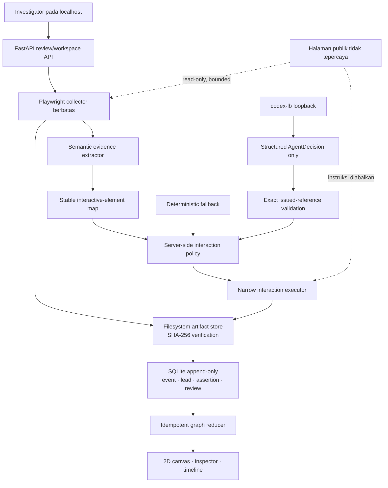
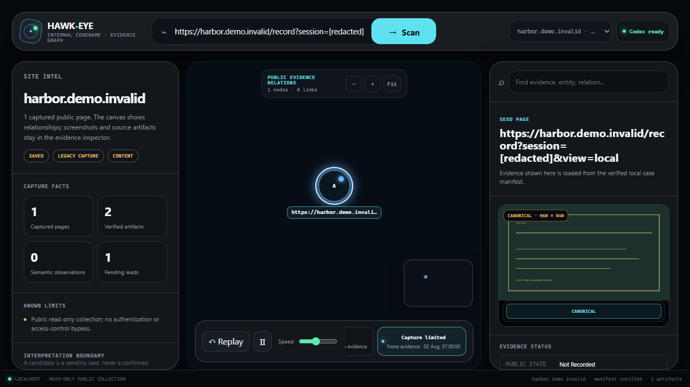
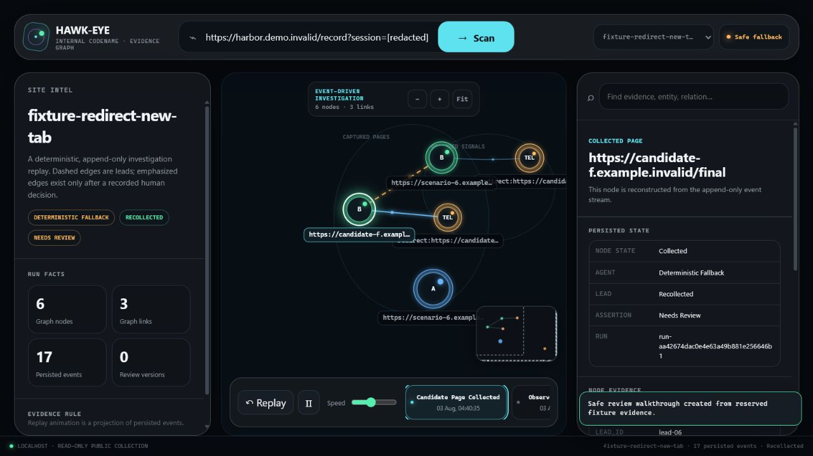
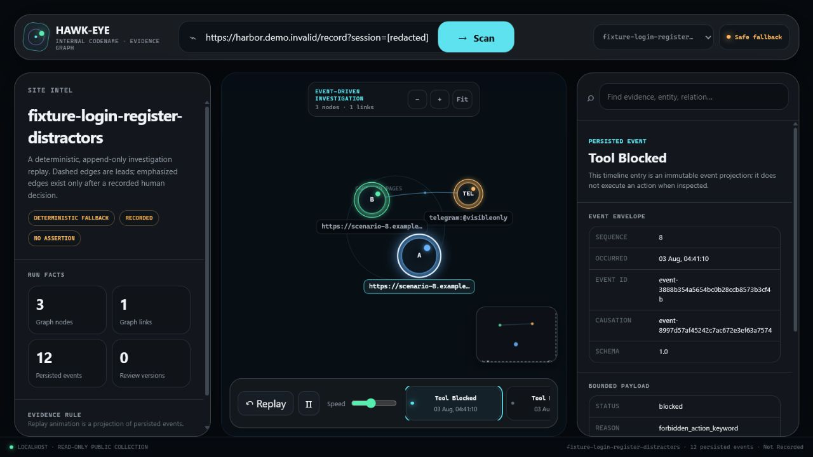

# [NAMA PRODUK FINAL]

**Proposal GEMASTIK XIX 2026 — Divisi Pengembangan Perangkat Lunak**  
**Project HAWK-EYE — nama internal pengembangan**

> **Status dokumen:** draf proposal baru berbasis implementasi MVP yang telah diverifikasi. Nama
> produk final, identitas tim, nomor peserta, dosen pembimbing, lembar pengesahan, serta tanda tangan
> tetap harus dikonfirmasi sebelum ekspor PDF dan pengunggahan.

**Diusulkan oleh Tim Ajarin Kami Sepuh**

| Nama | NIM |
|---|---:|
| Muchammad Yuda Tri Ananda | 24060124110142 |
| Olivia Oktaviani | 24060124120050 |
| Syifa Aeni Mudrikah | 24060124120027 |

**Universitas Diponegoro**  
**2026**

---

**Judul karya yang diusulkan**

> **[NAMA PRODUK FINAL]: Ruang Kerja Investigasi Bukti Web Publik Berbasis Graf dengan Agen AI
> Terbatas dan Human Review**

**Ringkasan**

Investigasi web publik sering menghasilkan screenshot, catatan, tautan, dan dugaan relasi yang
terpisah. Kondisi tersebut menyulitkan peninjau untuk menjawab tiga pertanyaan mendasar: apa yang
benar-benar tertangkap, dari artefak mana suatu temuan berasal, dan apakah sebuah relasi sudah
didukung bukti atau masih berupa kandidat. [NAMA PRODUK FINAL] menjawab masalah ini melalui alur
lokal yang menggabungkan tangkapan halaman berbatas, observasi semantik berprovenance, satu
interaksi baca yang dikendalikan kebijakan, recollection kandidat setelah persetujuan, human review
append-only, serta evidence graph yang dibangun dari event tersimpan.

Produk tidak menyimpulkan kepemilikan, operator, kriminalitas, atau status hukum suatu domain.
Istilah `verified` hanya berarti bukti yang dipilih mendukung jenis relasi yang dinyatakan. Agen AI
tidak mengendalikan browser secara bebas: model hanya memilih referensi elemen yang telah diterbitkan
server, sedangkan kebijakan server memutuskan apakah aksi boleh dijalankan. Jika layanan model tidak
tersedia atau keluaran tidak valid, fallback deterministik mempertahankan bentuk event dan
provenance yang sama. MVP berjalan hanya pada `127.0.0.1` dan benchmark resminya memakai tepat
sepuluh fixture sintetis agar dapat direproduksi tanpa bergantung pada situs nyata.

**Kata kunci:** bukti digital, OSINT, evidence graph, provenance, human review, safe browser
automation, event sourcing.

---

**Daftar Isi**

1. Judul/Nama Perangkat Lunak
2. Latar Belakang Ide Perangkat Lunak
3. Tujuan dan Manfaat Dikembangkannya Perangkat Lunak
4. Batasan Perangkat Lunak yang Dikembangkan
5. Metodologi Pengembangan Perangkat Lunak
6. Analisis Kebutuhan dan Desain Solusi Perangkat Lunak
7. Implementasi Perangkat Lunak
8. Screenshot Mockup Interface Perangkat Lunak
9. Dokumentasi Cara Penggunaan Perangkat Lunak

**Daftar Gambar**

1. Alur produk dari seed publik hingga evidence graph
2. Arsitektur sistem dan batas kepercayaan
3. Workspace graph-first dengan screenshot terverifikasi
4. Recollection Page B dan candidate assertion
5. Policy preflight yang memblokir kontrol tidak aman

**Daftar Tabel**

1. Tujuan dan indikator keberhasilan MVP
2. Sepuluh skenario interaksi terkontrol
3. Kebutuhan fungsional
4. Kebutuhan nonfungsional
5. Teknologi yang digunakan
6. Perbandingan pendekatan kerja
7. Cakupan kriteria penilaian
8. Hasil benchmark sintetis tiga pendekatan

## 1. Judul/Nama Perangkat Lunak

Nama publik perangkat lunak masih **[NAMA PRODUK FINAL]**. **HAWK-EYE** dipakai hanya sebagai nama
internal pengembangan agar tidak menetapkan merek publik sebelum tim menyelesaikan pemeriksaan nama
dan orisinalitas.

[NAMA PRODUK FINAL] adalah ruang kerja investigasi bukti web publik yang menghubungkan capture,
artefak, observasi, kandidat relasi, keputusan manusia, timeline, dan graf dalam satu alur yang dapat
diaudit. Nilai utamanya diringkas sebagai berikut:

> Dari halaman publik ke relasi yang dapat ditinjau—setiap langkah memiliki bukti, batas, dan jejak
> peristiwa.

Berbeda dari crawler yang hanya menghasilkan daftar URL atau dashboard yang langsung menampilkan
kesimpulan, produk menjaga lima lapisan tetap terpisah:

```text
Artifact → Observation → Entity → Candidate Assertion → Human Review
```

Pemisahan tersebut membuat pengguna dapat melihat bukan hanya *apa* yang ditemukan, tetapi juga
*bagaimana*, *kapan*, dan *dari bukti mana* temuan itu berasal.

## 2. Latar Belakang Ide Perangkat Lunak

Penelusuran suatu halaman web publik biasanya dimulai dari satu URL. Investigator kemudian
mengambil screenshot, menyalin teks, membuka beberapa tautan, mencatat kontak publik, dan mencoba
menghubungkan halaman yang memiliki petunjuk serupa. Jika seluruh hasil berada pada berkas atau tab
yang berbeda, provenance mudah terputus. Screenshot mungkin tidak menyimpan keadaan awal halaman,
catatan tidak menunjuk artefak sumber, dan garis pada graf dapat terlihat meyakinkan walaupun baru
berupa dugaan.

Masalah pertama adalah **keberhasilan navigasi tidak sama dengan kecukupan tangkapan**. Halaman
dapat memberi respons HTTP tetapi masih kosong pada saat awal, menampilkan DOM kaya yang sebenarnya
tersembunyi, terus berubah hingga akhir budget, memperlihatkan challenge atau pembatasan geografis,
atau mempunyai HTML terlalu besar untuk diekstrak. Karena itu, MVP memisahkan empat dimensi:
`navigation_status`, `access_outcome`, `capture_adequacy`, dan `extraction_eligible`.

Masalah kedua adalah **observasi tidak sama dengan kesimpulan**. Tautan WhatsApp publik, alias
Telegram, nomor telepon, redirect, referral code, klaim merek, atau tujuan download dapat diamati
dari halaman. Kemunculan nilai yang sama pada dua halaman belum membuktikan kepemilikan atau
operator yang sama. Produk hanya membuat candidate assertion dengan bukti pendukung dan status
`needs_review`.

Masalah ketiga adalah **interaksi browser otomatis memiliki risiko**. Tombol dapat membuka informasi
publik, tetapi juga dapat mengirim formulir, menjalankan login, membuka aplikasi eksternal, memulai
download, atau menuju transaksi. Memberikan kontrol Playwright tanpa batas kepada model akan
memperbesar risiko. Produk memakai referensi elemen yang terikat snapshot, budget aksi, dan
preflight policy di sisi server.

Masalah keempat adalah **visualisasi progresif tidak boleh menjadi sumber kebenaran**. Animasi node
dan edge berguna untuk menjelaskan perkembangan investigasi, tetapi refresh atau replay tidak boleh
mengubah relasi. Produk menyimpan event lebih dahulu, mereduksinya secara idempoten, lalu memakai
hasil reducer sebagai graph truth. Animasi hanya menjadi proyeksi visual.

Proposal ini tidak mencantumkan angka urgensi nasional, klaim dampak sosial terukur, atau hasil
wawancara pengguna karena sumber dan studinya belum diverifikasi. Materi tersebut harus ditambahkan
melalui sumber resmi atau akademik sebelum submission final.

**TODO — requires external source:** tambahkan statistik resmi Indonesia yang relevan, tanggal
akses, kalimat yang didukung, dan batas interpretasinya.  
**TODO — requires human confirmation:** lakukan uji kebutuhan/usability yang terdokumentasi; jangan
mengarang jumlah partisipan atau hasilnya.

## 3. Tujuan dan Manfaat Dikembangkannya Perangkat Lunak

Tujuan utama produk adalah menyediakan workflow investigasi web publik yang aman, dapat direproduksi,
dan mudah ditinjau dari satu seed hingga satu relasi kandidat.

| Tujuan | Indikator keberhasilan MVP |
|---|---|
| Menangkap halaman secara jujur | Status akses dan kecukupan terpisah; screenshot awal, kanonik, dan full-page tersedia bila dapat diambil |
| Menjaga provenance | Artefak memiliki metadata serta SHA-256; observasi menunjuk artefak dan screenshot sumber |
| Membuka bukti tersembunyi secara aman | Hanya satu aksi baca terpilih; seluruh aksi melewati policy server |
| Mengelola kandidat tanpa overclaim | Kandidat tetap `pending`/`needs_review`; recollection live memerlukan approval |
| Mempertahankan keputusan manusia | Riwayat assertion dan review disimpan append-only dalam SQLite |
| Menjelaskan investigasi | Graf, inspector, causal path, dan timeline berasal dari event tersimpan |
| Tetap berfungsi tanpa model | Fallback deterministik menghasilkan bentuk keputusan dan event yang sama |

Manfaat yang ditawarkan adalah:

1. **Keterlacakan bukti.** Pengguna dapat membuka screenshot, HTML inert, visible text, metadata,
   konteks observasi, serta event yang mendukung sebuah node atau edge.
2. **Pengurangan kesalahan interpretasi.** Candidate, collected destination, dan verified relation
   mempunyai tampilan dan status berbeda.
3. **Keselamatan yang dapat diuji.** Login, register, download, form submission, komunikasi, dan
   tujuan berbahaya diblokir sebelum klik.
4. **Reproduksibilitas demo.** Fixture `.invalid`, benchmark JSON, fallback deterministik, dan event
   reducer memungkinkan penilaian offline.
5. **Efisiensi peninjauan.** Screenshot-first inspector, pencarian node, minimap, timeline replay,
   dan review history tersedia pada satu workspace localhost.
6. **Dasar pengembangan bertahap.** Batas model, kebijakan, dan data terdokumentasi sehingga riset
   berikutnya dapat memperluas coverage tanpa mengaburkan kemampuan MVP.

Manfaat yang belum diklaim adalah peningkatan akurasi investigator nyata, penghematan waktu pada
organisasi, jumlah pengguna, dampak penindakan, atau keberlanjutan finansial. Semua memerlukan studi
lanjutan.

## 4. Batasan Perangkat Lunak yang Dikembangkan

MVP menerapkan batas berikut:

1. Hanya URL HTTP(S) publik yang lolos validasi URL, DNS, dan destination policy.
2. Satu scan mencakup maksimal tiga halaman same-site pada depth satu dan satu aksi baca yang
   dipilih untuk mengisi evidence gap.
3. Produk tidak login, register, membuat akun, memasukkan kredensial, menyelesaikan CAPTCHA,
   melewati pembatasan geografis, mengirim chat/form, membayar, deposit, withdrawal, betting,
   mengunduh binary, memasang aplikasi, atau menjalankan instruksi dari halaman target.
4. Kandidat eksternal yang belum pernah dikumpulkan tidak dibuka otomatis. Recollection live hanya
   dijalankan sekali setelah approval eksplisit, dengan budget satu halaman dan depth nol.
5. Observasi semantik memakai teks/DOM sebagai sumber utama. MVP tidak mengklaim OCR gambar atau
   pengenalan logo visual.
6. Produk tidak memberi label `illegal`, `criminal`, `verified_operator`, atau
   `confirmed_network`, serta tidak menghasilkan probabilitas kepemilikan.
7. Skor perbandingan baseline berarti kemiripan bukti, bukan kemungkinan dua domain dimiliki pihak
   yang sama.
8. Console hanya berjalan pada `127.0.0.1`, single-machine, tanpa autentikasi multi-user atau
   deployment publik.
9. Hasil situs live bersifat observasional karena dapat berubah menurut waktu, lokasi, VPN, sesi,
   challenge, dan kondisi jaringan. Fixture sintetis tetap menjadi test truth.
10. Risiko DNS time-of-check/time-of-use antara validasi aplikasi dan resolusi Chromium masih
    terdokumentasi; eliminasi penuh membutuhkan network-layer pinning atau validating proxy.

Jika recollection kandidat gagal, status tidak dinaikkan menjadi evidence node. Lead tetap
`unverified_search_lead`. Jika capture terbatas tetapi memiliki teks berguna, observasi diberi label
provisional dan limitation yang terlihat; capture tidak dipromosikan menjadi adequate.

## 5. Metodologi Pengembangan Perangkat Lunak

Pengembangan memakai milestone berbatas dan evidence-driven verification. Setiap milestone
menetapkan acceptance criteria, implementasi, fixture, test, demo, keputusan arsitektur, serta
limitation sebelum dilanjutkan.

1. **G4A — Capture Adequacy:** membedakan navigasi, akses, kecukupan, dan eligibility; menambahkan
   checkpoint serta artefak awal/kanonik/full-page.
2. **G4B — Semantic Evidence:** membentuk observasi bertipe dengan nilai mentah/normal, konteks,
   selector, screenshot/crop, confidence, method, dan limitation.
3. **G5 — Controlled Safe Expansion:** membuat tepat sepuluh fixture dan enam narrow tools dengan
   stable reference serta policy preflight.
4. **G6 — Bounded Codex Runtime:** melakukan capability probe, strict-schema validation,
   exact-reference validation, retry berbatas, dan fallback deterministik.
5. **G7 — Candidate Recollection and Review:** menyimpan lead, approval, Page B, assertion, dan
   review append-only.
6. **G8 — Event-driven Progressive Graph:** menyimpan event sebelum render, mereduksi idempoten,
   serta memisahkan graph truth dari animation queue.
7. **G9 — GEMASTIK Package:** menyelaraskan setiap klaim proposal dengan kode, test, benchmark,
   screenshot, dan limitation.

```mermaid
flowchart LR
    A["Seed publik"] --> B["Capture berbatas<br/>maks. 3 halaman · depth 1"]
    B --> C["Artefak terverifikasi<br/>screenshot · HTML · visible text · metadata"]
    C --> D["Observasi semantik<br/>verified atau provisional"]
    D --> E["Evidence gap eksplisit"]
    E --> F["Codex strict decision<br/>atau fallback deterministik"]
    F --> G["Policy preflight server"]
    G -->|"satu aksi baca aman"| H["Observable baru"]
    G -->|"tidak aman"| I["Blocked event<br/>executed = false"]
    H --> J["Direct candidate"]
    J --> K["Approval manusia"]
    K --> L["Recollection Page B"]
    L --> M["Candidate assertion"]
    M --> N["Human review append-only"]
    C --> O["Event log SQLite"]
    I --> O
    N --> O
    O --> P["Idempotent graph reducer"]
    P --> Q["Canvas · inspector · timeline"]
```



*Gambar 1. Alur produk dari seed publik hingga evidence graph. Garis proses menunjukkan urutan
operasi, bukan klaim hubungan antaroperator.*

### Skenario evaluasi terkontrol

| No. | Skenario | Perilaku yang diharapkan |
|---:|---|---|
| 1 | Visible evidence tanpa interaksi | Observable ditemukan tanpa klik |
| 2 | Modal aman | Satu tombol baca membuka observable |
| 3 | Menu aman | Satu tombol menu membuka tautan publik |
| 4 | Tab publik | Satu tab menampilkan konten tersembunyi |
| 5 | Iframe publik | Child content ditangkap secara berbatas |
| 6 | Redirect/new tab | Destination menjadi lead, lalu Page B fixture direcollect |
| 7 | Tombol ambigu | Aksi ditolak; tidak ada observable palsu |
| 8 | Login/Register distractors | Kedua kontrol diblokir sebelum eksekusi |
| 9 | Download distractor | Destination dicatat tetapi file tidak diunduh |
| 10 | Tidak ada hidden evidence | Sistem berhenti secara jujur setelah budget |

Fixture sintetis adalah sumber kebenaran benchmark. Pengamatan live hanya dipakai sebagai
robustness note dan tidak mengubah expected result.

## 6. Analisis Kebutuhan dan Desain Solusi Perangkat Lunak

### 6.1 Kebutuhan fungsional

| Kode | Kebutuhan fungsional |
|---|---|
| KF-01 | Sistem menerima seed URL publik dan memvalidasi format serta destination policy. |
| KF-02 | Sistem menangkap maksimal tiga halaman same-site pada depth satu. |
| KF-03 | Sistem mencatat checkpoint 0/500/1500/3000 ms dan settle 5000/8000 ms bila diperlukan. |
| KF-04 | Sistem menyimpan screenshot awal, kanonik, full-page, visible text, HTML, response metadata, readiness, dan hash sesuai batas ukuran. |
| KF-05 | Sistem membedakan navigation, access outcome, capture adequacy, extraction eligibility, dan public status. |
| KF-06 | Sistem mengekstrak observasi semantik publik dengan provenance dan limitation. |
| KF-07 | Sistem menerbitkan stable element reference, menolak reference stale, dan melakukan policy preflight. |
| KF-08 | Sistem menjalankan satu keputusan Codex yang schema-valid atau fallback deterministik. |
| KF-09 | Sistem mencatat direct link, redirect, new tab, iframe destination, dan candidate lead tanpa auto-crawl. |
| KF-10 | Sistem merecollect Page B setelah approval yang diwajibkan dan membuat assertion berbukti. |
| KF-11 | Sistem menyimpan assertion, review, dan event secara append-only di SQLite. |
| KF-12 | Sistem membangun graph state idempoten dari event dan menampilkan status edge berbeda. |
| KF-13 | Sistem menyediakan screenshot inspector, artifact links, search/focus, minimap, timeline, replay, dan reduced motion. |
| KF-14 | Sistem menghasilkan benchmark JSON dan Markdown untuk static, rule-based, dan agent-assisted fallback. |

### 6.2 Kebutuhan nonfungsional

| Kode | Kategori | Kebutuhan nonfungsional |
|---|---|---|
| KNF-01 | Keamanan | Bind hanya ke `127.0.0.1`, Host allowlist, no CORS, same-origin mutation check, CSP ketat, dan artifact inert. |
| KNF-02 | Integritas | Artefak disimpan dengan ukuran, MIME type, path, dan SHA-256 serta diverifikasi saat dibaca. |
| KNF-03 | Auditabilitas | Event memiliki urutan monoton, causation, correlation, timestamp, dan schema version. |
| KNF-04 | Reproduksibilitas | Fixture `.invalid`, fallback deterministik, raw benchmark, dan local demo dapat dijalankan ulang. |
| KNF-05 | Bounded execution | Maksimal 5 iterasi, 3 interaksi, 3 halaman, depth 1, 5 redirect, 1 query, 3 candidate page, dan 120 detik. |
| KNF-06 | Aksesibilitas | Informasi tidak hanya bergantung warna; tersedia tabel relasi dan reduced-motion. |
| KNF-07 | Privasi | Tidak ada kredensial, cookie, data browser profile, atau raw live artifact dalam proposal/repository. |
| KNF-08 | Maintainability | Model Pydantic, modul policy/agent/reducer terpisah, ADR, type check, lint, dan automated tests. |

### 6.3 Arsitektur dan batas kepercayaan



*Gambar 2. Arsitektur sistem. Model tidak memiliki akses Playwright, shell, filesystem, atau mutasi
database langsung.*

### 6.4 Teknologi yang digunakan

| Teknologi | Fungsi pada implementasi |
|---|---|
| Python | Runtime utama, model data, pipeline, benchmark, dan CLI |
| Playwright + Chromium | Render halaman publik dan capture screenshot secara defensif |
| FastAPI | API localhost, artifact delivery terverifikasi, dan workspace mutation berbatas |
| SQLite | Event, lead, assertion, approval, dan review append-only |
| Pydantic | Validasi schema internal dan structured agent decision |
| HTML/CSS/JavaScript Canvas 2D | Graph-first console, animasi, minimap, inspector, dan timeline |
| codex-lb loopback | Optional strict-output Codex path; tidak menjadi dependency wajib |
| Pytest, Ruff, mypy | Test, formatting/lint, dan static type verification |

Produk tidak menggunakan PostgreSQL, distributed queue, Kubernetes, public hosting, atau mandatory
WebSocket pada MVP.

### 6.5 Data yang digunakan

| Jenis data | Contoh | Perlakuan |
|---|---|---|
| Seed | URL publik | Divalidasi dan dibatasi same-site |
| Capture | Screenshot, HTML, visible text, readiness | Disimpan dengan hash dan limitation |
| Observation | Kontak publik, outgoing link, redirect, klaim, referral | Menunjuk artefak dan konteks sumber |
| Candidate | Domain/URL hasil direct evidence | Pending; tidak sama dengan relationship conclusion |
| Assertion | `publicly_links_to`, `shares_redirect_target_with`, dan lainnya | Selalu mulai `needs_review` |
| Review | outcome, reviewer label, reason, version | Append-only; current state diturunkan dari event terbaru |
| Investigation event | kind, sequence, causation, payload | Sumber graph truth dan timeline |
| Fixture benchmark | expected observable/action/relation/block | Sumber hasil evaluasi resmi |

### 6.6 Perbandingan pendekatan kerja

Perbandingan ini membahas pola workflow, bukan klaim keunggulan terhadap produk bermerek tertentu.

| Kemampuan | Catatan manual terpisah | Crawler daftar-URL | [NAMA PRODUK FINAL] MVP |
|---|:---:|:---:|:---:|
| Screenshot dan teks terikat provenance | Bergantung disiplin pengguna | Bervariasi | Ya |
| Status capture adequacy terpisah | Tidak otomatis | Bervariasi | Ya |
| Safe interaction preflight | Manual | Umumnya bukan fokus | Ya |
| Candidate berbeda dari verified relation | Bergantung pencatat | Tidak selalu | Ya |
| Approval sebelum recollection live | Manual | Tidak selalu | Ya |
| Review history append-only | Tidak otomatis | Tidak selalu | Ya |
| Event-derived progressive graph | Tidak | Tidak selalu | Ya |
| Offline deterministic benchmark | Tidak | Bervariasi | Ya, 10 fixture |

### 6.7 Cakupan kriteria penilaian

| Kriteria GEMASTIK | Bobot | Bukti pada produk | Batas klaim |
|---|---:|---|---|
| Inovasi | 20% | Empat dimensi capture; capability-gated agent; event-first evidence graph | Novelty eksternal belum diteliti secara sistematis |
| Dampak dan keberlanjutan | 20% | Workflow lokal reproducible; fallback tanpa paid search | Dampak pengguna dan model keberlanjutan belum diuji |
| UI/usability/UX | 20% | Graph-first workspace, screenshot inspector, timeline/replay, search/focus, reduced motion | Belum ada studi usability formal |
| Proses pengembangan | 20% | G4A–G9, ADR, 176 tests, raw benchmark, logical commits | Verifikasi ini merepresentasikan environment lokal tercatat |
| Kesesuaian ide–software | 10% | Alur Page A → observable → Page B → assertion → review berjalan pada fixture | Live site bukan benchmark truth |
| Urgensi masalah | 10% | Risiko kehilangan provenance dan unsafe automation dijelaskan | Angka urgensi eksternal masih TODO |

## 7. Implementasi Perangkat Lunak

### 7.1 Capture adequacy

Setelah `domcontentloaded`, collector mencatat checkpoint pada 0, 500, 1500, dan 3000 ms. Jika
halaman informatif masih berubah, observasi dapat diperpanjang secara berbatas ke 5000 dan 8000 ms.
Collector tidak klik, scroll, dismiss consent, login, atau menunggu `networkidle` pada proses ini.

HTML sampai 5 MB dapat dipersist, tetapi extractor input dibatasi 2 MB. HTML 2–5 MB disimpan dengan
alasan skip extraction. Di atas 5 MB, screenshot, visible text, response metadata, byte count,
readiness, dan alasan omission tetap dipertahankan; ukuran besar tidak diklasifikasikan sebagai
navigation failure. Full-page screenshot dibatasi 12.000 piksel.

### 7.2 Observasi semantik

Implementasi mendukung 15 kategori observable: claimed brand identity, Telegram alias, Telegram
contact, WhatsApp link, phone number, email address, outgoing link, redirect target, download
destination, payment method, payment provider, offer claim, legal/license claim, referral code, dan
tracking identifier. Observasi menyimpan nilai mentah serta normal, source page/artifact/event,
selector, surrounding text, screenshot/crop, confidence, extraction method, strength, dan
limitation.

Brand yang terlihat disimpan sebagai **ClaimedBrandIdentity**, bukan ownership. Payment, offer, dan
legal claim yang lemah tetap berlabel weak. Crop screenshot dibuat best-effort; kegagalan crop tidak
menghapus observasi.

### 7.3 Interaksi aman dan agen terbatas

Enam tool sempit menyediakan state, daftar elemen, safe click, public-link open, capture result, dan
redirect chain. Stable reference memuat DOM path, role, tag, accessible name, visible text,
href/action, fingerprint, dan snapshot ID. Executor menolak referensi stale atau tidak cocok.

Capability probe aktual pada 3 Agustus 2026 menemukan model `gpt-5.6-terra` melalui route loopback
dan memverifikasi strict JSON-schema output. Pada pengamatan QQ yang diotorisasi pemilik, Codex
memilih referensi Contact yang diterbitkan server. Policy memvalidasi ulang aksi, lalu sistem
menyimpan screenshot/HTML/text/JSON hasil route informasi publik dan mengekstrak kanal kontak yang
memang hadir pada artefak. Pengamatan tersebut disimpan lokal dan tidak menjadi benchmark resmi.

Model tidak mengeksekusi tool secara langsung. Jika probe, transport, schema, atau exact-reference
check gagal, dua retry berbatas diikuti fallback deterministik. Live Chat, kirim pesan/form, login,
register, payment, download, external-app launch, challenge, dan bypass tetap diblokir.

### 7.4 Candidate assertion, review, dan graph event

Pada fixture canonical `redirect-new-tab`, Page A menghasilkan evidence gap dan satu safe action.
Destination menjadi lead, Page B direcollect menjadi artefak, lalu sistem membuat
`shares_redirect_target_with` assertion yang menunjuk observasi kedua halaman. Edge kandidat tampil
dashed. Review `verified` menambahkan event versi baru dan mengubah hanya edge yang didukung menjadi
solid emphasized. Rejected edge disembunyikan secara default tetapi tetap dapat diaudit.

Untuk situs nyata, candidate direct link menunggu `candidate_page.approved`. Setelah approval,
produk menjalankan satu collection dengan page/depth budget 1/0 dan hanya dapat mengusulkan
`publicly_links_to`. Generated candidate tidak pernah auto-crawl.

### 7.5 Hasil benchmark sintetis

Benchmark menjalankan 50 attempt: 10 static, 10 rule-based, dan 30 agent-assisted deterministic
fallback. Angka berikut hanya berlaku pada sepuluh fixture terkontrol.

| Pendekatan | Provenance | Unsafe block | Task success | Observable recall | Precision | Mean actions | Candidate support | Replay |
|---|---:|---:|---:|---:|---:|---:|---:|---:|
| Static | 1.0000 | 1.0000 | 0.5000 | 0.2857 | 1.0000 | 0.0000 | 0.1667 | 1.0000 |
| Rule-based | 1.0000 | 1.0000 | 1.0000 | 1.0000 | 1.0000 | 0.6000 | 1.0000 | 1.0000 |
| Agent-assisted deterministic fallback | 1.0000 | 1.0000 | 1.0000 | 1.0000 | 1.0000 | 0.6000 | 1.0000 | 1.0000 |

Empat kontrol terlarang unik—Contact ambigu, Login, Register, dan Download—divalidasi pada masing-
masing pendekatan, menghasilkan 12 policy checks dan seluruhnya diblokir. Tiga fallback attempts per
skenario menghasilkan satu normalized signature per skenario. Hasil tersebut tidak mengukur live
site accuracy, kecerdasan model, ownership, kriminalitas, atau status hukum.

### 7.6 Verifikasi implementasi

Snapshot verifikasi 3 Agustus 2026:

- Ruff format: 122 file sudah terformat;
- Ruff lint: lulus;
- mypy strict: 60 source file lulus;
- JavaScript syntax check: lulus;
- pytest: **176 passed** dalam 470,26 detik, satu warning deprecation upstream;
- benchmark 10 fixture × tiga mode: lulus;
- unsafe controlled-action block rate: **1.0**;
- local demo dan localhost UI walkthrough: lulus;
- `git diff --check`: lulus.

## 8. Screenshot Mockup Interface Perangkat Lunak

Nama bagian mengikuti susunan resmi proposal, tetapi gambar berikut adalah tangkapan aktual software
localhost, bukan mockup statis atau graph palsu. Semua gambar proposal memakai domain fixture
`.invalid`; screenshot live, cookies, kredensial, dan data sesi tidak disertakan.



*Gambar 3. Workspace aktual berisi Site Intel, 2D canvas, minimap, timeline, evidence inspector, dan
screenshot full-page fixture terverifikasi.*

Canvas mendukung force relaxation, edge particle, pan, zoom, drag, hit-testing, focus, fit, search,
minimap, replay, dan reduced-motion. Node mewakili page/domain, claimed brand, public contact,
external destination, dan candidate domain—bukan setiap file, script, font, atau request jaringan.



*Gambar 4. Page B fixture setelah recollection. Inspector menyediakan artefak Page A/Page B,
observasi pendukung, assertion, event trail, timestamp, dan limitation.*



*Gambar 5. Event `tool.blocked` untuk kontrol Login. Inspector menunjukkan alasan policy dan
`executed=false`, sehingga safety claim dapat diperiksa dari event, bukan hanya dari tampilan.*

Metadata reproduksi, viewport, hash SHA-256, waktu capture, source run, dan status sanitasi gambar
tercatat di `FIGURE_INDEX.md`.

## 9. Dokumentasi Cara Penggunaan Perangkat Lunak

### 9.1 Instalasi lokal

Prasyarat: Python yang kompatibel dengan proyek, Node.js hanya untuk syntax/build gate frontend
yang relevan, serta Chromium Playwright.

```powershell
python -m pip install -e ".[dev]"
python -m playwright install chromium
```

### 9.2 Menjalankan benchmark resmi lokal

Gunakan direktori output baru karena command menolak overwrite:

```powershell
python -m hawkeye benchmark `
  --output verification-output/benchmark-reproduction `
  --agent-attempts 3
```

Output utama adalah `raw-results.json` dan `BENCHMARK_RESULTS.md`. Bandingkan nilai struktural dan
rate dengan hasil checked-in; runtime per attempt dapat berbeda menurut mesin.

### 9.3 Menjalankan demo dan console

```powershell
python -m hawkeye demo --output verification-output/demo-proposal

python -m hawkeye serve `
  --cases verification-output/demo-proposal/cases `
  --workspace verification-output/mvp-workspace `
  --port 8760
```

Buka `http://127.0.0.1:8760/`. Server tidak boleh di-bind ke alamat publik.

### 9.4 Alur penggunaan investigator

1. Masukkan URL publik pada command bar lalu tekan **Scan**.
2. Periksa access outcome, capture adequacy, limitation, dan screenshot full-page pada evidence
   inspector.
3. Buka Initial/Canonical/Full-page carousel untuk membandingkan perubahan render.
4. Tinjau observasi semantik beserta raw/normalized value, konteks, dan artifact source.
5. Lihat timeline untuk mengetahui apakah Codex strict path atau fallback deterministik digunakan.
6. Periksa tool preflight. Aksi terlarang harus muncul sebagai blocked dengan `executed=false`.
7. Jika ditemukan direct candidate yang belum tersimpan, pilih **Approve candidate collection**
   hanya setelah memeriksa URL dan alasan lead.
8. Setelah Page B direcollect, tinjau supporting observations dan candidate assertion.
9. Tambahkan review `verified`, `rejected`, `needs_more_evidence`, `duplicate`, atau `uncertain`
   beserta reason. Riwayat lama tidak ditimpa.
10. Gunakan graph, search/focus, minimap, causal path, dan replay untuk memeriksa perubahan relasi.

### 9.5 Alur demonstrasi penilai

Gunakan fixture selector dan pilih **New safe review walkthrough**. Tampilkan urutan berikut:

```text
Page A capture
→ evidence gap
→ satu safe interaction
→ redirect observable
→ candidate lead
→ Page B recollection
→ dashed candidate assertion
→ append-only human review
→ solid emphasized verified relation
→ replay dari event awal
```

Kemudian jalankan skenario Login/Register untuk memperlihatkan `tool.blocked` tanpa eksekusi. Demo
ini tidak membutuhkan situs live atau endpoint model.

### 9.6 Troubleshooting ringkas

| Kondisi | Penanganan |
|---|---|
| Endpoint Codex unavailable | Lanjutkan dengan fallback deterministik; periksa capability diagnostic tanpa menyalin secret |
| Capture `limited` | Baca limitation dan artefak provisional; jangan mengubahnya menjadi adequate secara manual |
| Candidate menunggu approval | Verifikasi bahwa URL berasal dari direct public evidence sebelum approve |
| Recollection gagal | Pertahankan `unverified_search_lead`; jangan membuat evidence node palsu |
| Artifact integrity warning | Hentikan peninjauan artefak tersebut dan cocokkan hash/manifest |
| Host header ditolak | Akses hanya melalui `127.0.0.1` atau `localhost` yang diizinkan |

### 9.7 Material final yang masih harus diselesaikan manusia

- tentukan dan periksa **[NAMA PRODUK FINAL]**;
- konfirmasi identitas tim, ID peserta, kategori, dosen pembimbing, dan lembar pengesahan;
- tambahkan sumber resmi/akademik untuk urgensi, dampak, dan state of the art;
- lakukan uji pengguna yang nyata bila hendak membuat klaim usability;
- verifikasi originality, publication history, dan license dependency;
- render ke template resmi, cek 24–27 halaman dan jangan melebihi 30 halaman;
- periksa font, margin, caption, tabel, tautan, nomor halaman, ukuran PDF, dan penamaan berkas;
- rekam video tiga menit dari software aktual;
- unggah hanya oleh pihak berwenang setelah checklist selesai.

**Referensi utama dokumen**

1. Kementerian Pendidikan Tinggi, Sains, dan Teknologi. *Penawaran GEMASTIK 2026*, 22 Juli 2026.
   https://kemdiktisaintek.go.id/announcement/article/penawaran-gemastik-2026
2. Balai Pengembangan Talenta Indonesia/Kemdiktisaintek. *Panduan GEMASTIK XIX Tahun 2026*.
   Tautan panduan berasal dari pengumuman resmi di atas; periksa kembali revisi sebelum submission.
3. Bukti internal terverifikasi: `docs/GOAL.md`, `docs/DECISIONS.md`, `docs/EVALUATION.md`,
   `gemastik-2026/IMPLEMENTATION_STATUS.md`, `gemastik-2026/FIGURE_INDEX.md`, serta
   `evaluation/benchmarks/g4-g9-controlled-results/raw-results.json`.

> Dokumen ini sengaja tidak menjadi PDF final. Markdown adalah source of truth sampai seluruh
> identitas, citation, declaration, layout, dan checklist submission dikonfirmasi.
